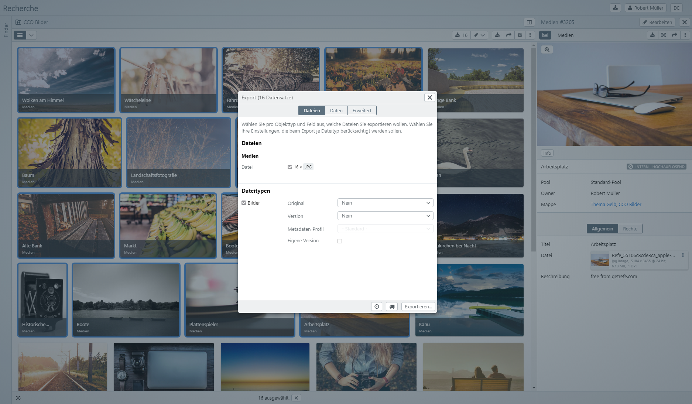
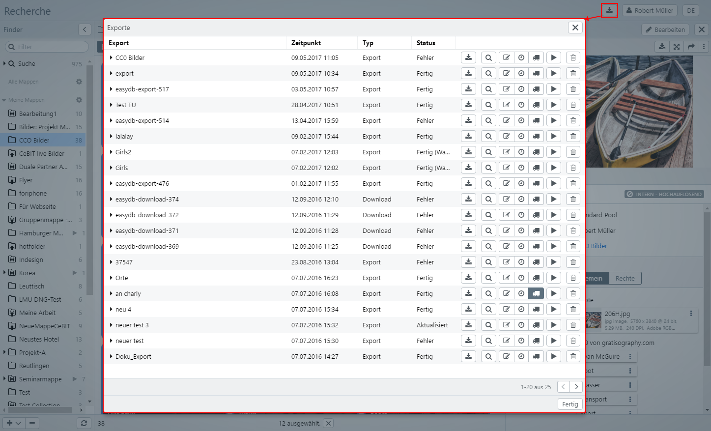
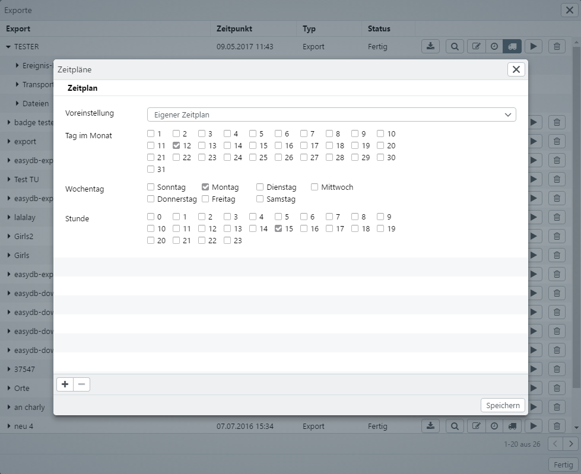

# Export {#maindialog}

Grundsätzlich können Sie alle Daten, die Sie recherchieren können, auch aus easydb exportieren.

Exporte werden in easydb zunächst erstellt und dann ausgeführt. Nach der Ausführung werden die Daten für den Download bereitgestellt oder über einen Transportweg (wahlweise z.B. RSYNC, FTP) zu einem anderen Server kopiert. Die Ausführung der Exporte erfolgt auf dem easydb Server asynchron, da diese Vorgänge u.U. viel Zeit benötigen.

>HINWEIS: Exporte können mit Zeitplänen (*siehe unten*) versehen und dann von easydb automatisch periodisch ausgeführt werden. Damit können Sie z.B. regelmäßige Backups Ihrer easydb erstellen oder zeitlich definierte Datenexporte durchführen.

Innerhalb eines Export-Vorgangs können Sie Dateien in verschiedenen Größen berechnen lassen, Ausschnitte aus Bildern exportieren und ein Format für den Export festlegen.

Exporte können über verschiedene Wege aus der easydb angelegt werden:

* Einzelner Datensatz (Rechtsklick im Suchergebnis)
* Auswahl (Rechtsklick auf einen ausgewählten Datensatz)
* Mappe (Rechtsklick auf die Mappe)
* Suche (Rechtsklick im Suchergebnis)



Im oberen Teil des Dialogs können Sie festlegen welche Dateien exportiert werden. Im unteren Teil legen Sie fest, welche Daten exportiert werden. Datensätze werden mit Daten als CSV oder XML getrennt von den eigentlichen Dateien exportiert. Auf Wunsch können Sie in den Daten auch Links zu den Dateien exportieren.

Klicken Sie nach den Einstellungen auf <code class="button">Exportieren...</code>, um den Export anzulegen und zu starten.

Bevor der Export startet erscheint noch ein Hinweis-Dialog, in dem ein Name eingetragen werden kann. Für Exporte mit Zeitplänen müssen Sie einen Namen vergeben. Für Exporte ohne Zeitpläne ist der Name optional.


Klicken Sie anschließend auf <code class="button">Speichern</code> um den Export final zu starten.

## Dateien


Hier wählen Sie pro Objekttyp und Feld aus, welche Dateien Sie exportieren wollen. Hinter dem jeweiligen Feldnamen erscheint die Angabe, welcher Dateityp wie oft vorhanden ist. Es werden bei diesen Zahlen nur die bevorzugten Versionen der Dateien berücksichtigt.

## Dateitypen

Hier entscheiden Sie je Dateityp, ob die Dateien dieses Typs mit für den Export berücksichtigt wird oder nicht. Zusätzlich kann je Dateityp festgelegt werden, welche Version der Datei exportiert wird und ggfs. festgelegt ob es noch eine Größen- oder Formatsanpassung während des Exports gibt.

Im Einzelnen lassen sich die folgenden Einstellungen vornehmen:

### Allgemeine Einstellungen

|Einstellung| |Erklärung|
|--|--|--|
|Original|Nein|Es wird keine Originaldatei exportiert.|
| |Original|Es wird nur das *Original* exportiert.|
| |Aktuelles Original|Das ist die bevorzugte sichtbare Version der Datei. Wenn Sie beispielsweise ein Bild gedreht oder ausgeschnitten haben, wird diese Version als *Aktuelle Version* bezeichnet, das unveränderte Bild wird als *Original* bezeichnet. Für Dateien, die in der easydb nicht gedreht oder anderweitig verändert wurden, sind *Aktuelle Version* und *Original* identisch.|
| |Original + Aktuelle Version|Es werden *Original* und *Aktuelles Original* exportiert.|
|Variante |Nein| Für den Export wird keine weitere Variante der zu exportierenden Datei berechnet. |
| |Vorberechnete Variante|Hier sehen Sie in der Auswahl eine Liste vorberechneter Varianten. Welche Varianten hier erscheinen ist Teil der [System-Administrations-Konfiguration](../../../../sysadmin/konfiguration/konfiguration.html). Je nach Dateityp sind diese Varianten unterschiedlich. Sie können aus der Liste wählen, welche Variante/Größe zusätzlich zum Original und/oder zum aktuellen Original exportiert werden soll.|
|Metadaten-Profil| |Das Profil welches zum XML/EXIF/IPTC-Schreiben benutzt wird. Verfügbar für die Dateitypen *Bild*, *Audio*, *Video*.|
|Eigene Variante | |Für einige Dateitypen steht diese Einstellung zur Verfügung. Damit können je nach Dateityp individuelle Anpassungen des Formats für den Export vorgenommen werden.|
| |Wasserzeichen|Wenn gesetzt, wird in die Datei (nur bei Bildern) ein Wasserzeichen eingerechnet. Das Wasserzeichen wird beim [Pool](../../../rightsmanagement/pools/pools.html) festgelegt. Nur Bilder die in einem Pool liegen, können mit einem Wasserzeichen versehen werden. Nur für den Dateityp *Bild* verfügbar.|
| |-&nbsp;Unverändert&nbsp;-|Die Datei bekommt die Metadaten der *Original*-Version.|
| |-&nbsp;Standard&nbsp;-|Hier wird das Profil von den Einstellungen beim *Pool* bzw. *Objekttyp* verwendet.|
| |-&nbsp;Entfernen&nbsp;-|Die Datei wird ohne Metadaten exportiert.|
| |*&lt;Profil&gt;*|Angabe eines *Profils*, welches für den Export benutzt wird.|


### Format-Optionen für Bilder

|Einstellung| |Erklärung|
|--|--|--|
|Format|Unverändert|Das Format der ausgewählten *Version* wird beibehalten.|
| |JPEG|JPEG-Format mit Angabe von Qualität *Gering*, *Mittel*, *Hoch*, *Maximum*.|
| |TIFF|TIFF-Format|
| |PNG|PNG-Format|
| |BMP|BMP-Format|
|Farbraum|RGB|RGB-Farbraum|
| |CMYK|CMYK-Farbraum|
| |Graustufen|Graustufen|
| |Größe: <br > *1) Voreingestellte Größen* <br> *2) Eigene...*|1) Es wird die Liste der voreingestellten Größen angezeigt. <br > 2) Wählen Sie diese Einstellung, um eine eigene Größe festzulegen.|
|Maß|Lange Seite|Die Pixel-Angabe bezieht sich auf die lange Seite, bei beispielsweise 400 Pixeln und einem 800 x 600 großen Bild, wird das Bild 400 x 300 Pixel groß.|
| |Kurze Seite|Die Pixel-Angabe bezieht sich auf die kurze Seite. Bei beispielsweise 400 Pixel und einem 800 x 600 großen Bild, wird das Bild 600 x 400 Pixel groß.|
| |Breite|Die Pixel-Angabe bezieht sich auf die Breite des erzeugten Bildes.|
| |Höhe|Die Pixel-Angabe bezieht sich auf die Höhe des erzeugten Bildes.|
|Pixel| |Anzahl der Pixel für die Maß-Angabe. Beachten Sie, dass beim Export keine Angabe von DPI zur Berechnung der Maße/des Maßes möglich ist. Um DPI berechnen zu können, muss das Ziel-Druck-Format bekannt sein. Dieses wird dann unweigerlich wieder in Pixel-umgerechnet.|


### Format-Optionen für Videos

Es werden keine Format-Veränderungen für Videos unterstützt. Sie können auf die vorproduzierten Formate zugreifen und mit einem externen Programm eine Format-Umwandlung durchführen.

### Format-Optionen für Audios

Es werden keine Format-Veränderungen für Audios unterstützt. Sie können auf die vorproduzierten Formate zugreifen und mit einem externen Programm eine Format-Umwandlung durchführen.

### Format-Optionen für Office & PDF

|Einstellung| |Erklärung|
|--|--|--|
|Format|PDF|Wählen Sie diese Einstellung, um aus Office-Dokumenten wie Word, Excel, etc. ein PDF zu erstellen.|


### Format-Optionen für sonstige Dateitypen

*Es werden keine Format-Veränderungen für sonstige Dateitype unterstützt.*


## Daten


|Einstellung| |Erklärung|
|--|--|--|
|CSV-Datei erzeugen| |Erzeugt eine CSV mit allen Daten.|
|JSON-Datei erzeugen| |Exportiert die Daten als JSON (in eine Datei).|
|Eine JASON-Datei pro Datensatz||Exportiert JSON in eine Datei pro Datensatz.|
|XML-Datei erzeugen| |Export die Daten als XML (in eine Datei).|
|Eine XML-Datei pro Datensatz||Exportiert XML in eine Datei pro Datensatz.|
|XML Profil|-&nbsp;Standard&nbsp;-|easydb Standard XML Format|
| |-&nbsp;Standard (flach)&nbsp;-|easydb Standard XML Format|
| |*&lt;Profil&gt;*|Benutzt das angegebene Profil zur Erzeugung des XML.|
|Eigene Felder auswählen||Wenn gesetzt können eigene Felder definiert werden (siehe nachfolgend **Feldauswahl**)|


### <a name=feldauswahl></a>Feldauswahl

Normalerweise werden alle Felder exportiert, die in der Maske verfügbar sind und auch in der Suche zur Anzeige benutzt werden (Detail-Ansicht). Wünschen Sie das nicht oder wollen Sie den Feldern eine eigene Bezeichnung geben, dann verwenden Sie den Feld-Auswahl-Dialog.

> Felder werden soweit nicht anders definiert mit Ihrem Datenbank-Namen exportiert, nicht mit dem sichtbaren Feld-Bezeichner aus der Maske.


Markieren Sie die Checkbox für die Felder, die Sie im Export benutzen wollen. Ändern Sie den Bezeichner für Ihren Export.

Die Reihenfolge der Felder lässt sich nicht verändern. Es wird die Reihenfolge verwendet, die durch die Maske vorgegeben ist.

#### Verknüpfte Objekttypen

Verknüpfte Objekttypen lassen sich grundsätzlich in eine Ebene exportieren, d.h. eine Verknüpfung ab dem ersten verknüpften Datensatz wird nicht weiterverfolgt.


#### Mehrfachfelder

Mehrfachfelder werden im Standard-Format exportiert. Wählen Sie dazu die Checkbox neben dem Mehrfachfeld-Namen. Wenn Sie einen Export einzelner Felder benötigen, benutzen Sie die Checkboxen unterhalb des Mehrfachfeldes.


#### Dateifelder

Für Dateien kann in den Daten ein Link exportiert werden. Es wird je exportierter Version (*Original* und *Aktuelle Version*) ein Link angegeben. Sie können einstellen, worauf diese Links zeigen.

|Einstellung| |Erklärung|
|--|--|--|
|URL|- Nein -|Ist voreingestellt. Es wird kein Link exportiert. |
| |Original|Hier kann der Link für das Original, das aktuell verwendete Original oder für beide Versionen ausgewählt werden.|
| |Klein|*Ja* wählen, damit der Link zu einer kleinen Version exportiert wird.|
| |Vorschau|*Ja* wählen, damit der Link zu einer Vorschauversion exportiert wird.|
| |Groß|*Ja* wählen, damit der Link zu einer großen Version exportiert wird.|

## Eweitert


|Einstellung| |Erklärung|
|--|--|--|
|Paket-Größe| 100 (Standard) | Erzeugt Export-Pakete mit je 100 Datensätze.|
|| Unbegrenzt (alles in einem Ordner) | Alle Datensätze dieses Exports werden in einen Ordner gepackt.|
|| Eigener Wert | Eigene Zahl für die Größe je Paket eintragen.|
|Dateiname| Standard-Template | Es wird der aktuelle Name aus dem Standard-Template verwendet.|
|| Original-Dateiname | Es wird der Name der Originaldatei verwendet. |
|| Dateiname | Es kann ein eigener Dateiname eingetragen werden. Hierfür können Ersetzungen verwendet werden, die auch für den jeweiligen Objekttypen (siehe [*Dateinamen für Export und Download*](../../../rightsmanagement/objecttypes/objecttypes.html)) zur Verfügung stehen.|
||Ersetzungen|```%medien_ab.text2%```<BR>```%medien_ab.text1%```<BR>```%medien_ab.text4%```<BR>```%medien_ab.text5%```<BR>```%medien_ab.boolean%```<BR>```%medien_ab.datum1%```<BR>```%medien_ab.datum3%```<BR>```%medien_ab.datum2%```<BR>```%medien_ab.zahl1%```<BR>```%medien_ab.zahl2%```<BR>```%medien_ab.lk_systematik_id._standard.1.text%```<BR>```%medien_ab.ort._standard.1.text%```<BR>```%medien_ab.fotograf._standard.1.text%```<BR>```%medien_ab.url%```<BR>```%medien_ab.link%```<BR>```%medien_ab.text3%```<BR>```%medien_ab.medium%```<BR>```%medien_ab.medium2%```<BR>```%medien_ab.email%```<BR>```%medien_ab.nurregexp%```<BR>```%medien_ab.regexpundhinweis%```<BR>```%_export.name%```<BR>```%_system.easydb.name%```<BR>```%_global_object_id%```<BR>```%_system_object_id%```<BR>```%_asset.original_filename%```<BR>```%_asset.version%```<BR>```%_asset.class%```<BR>```%_asset.extension%```<BR>```%_asset.technical_metadata.width%```<BR>```%_asset.technical_metadata.height%```<BR>```%_asset.technical_metadata.max_dimension%```|
|Umfang|Checkbox|Mit dem Setzen der Checkbox werden für den Export nur neue und veränderte Datensätze berücksichtig .Beim ersten Durchlauf des Exports, exportiert easydb alle Datensätze, die sich innerhalb des Exportes befinden. Beim nächsten Export werden nur veränderte Datensätze exportiert (z.B. durch einen manuellen Neustart des Exports oder durch einen Zeitplan).|


# Liste der Exporte {#exportmanager}

Exporte aus dem Exportmodul können oben rechts über den **Exportmanager** <i class="fa fa-download"></i> aufgerufen und die *Exportliste* angezeigt werden.



Der Status eines laufenden Exports wird durch einen kleinen Badge am Exportmanager angezeigt.

|Symbol|Erklärung|
|--|--|
||Es gibt keinen aktiven Vorgang in der Exportliste.|
||Exporte warten auf Bearbeitung oder werden gerade bearbeitet.|
||Exporte sind fertig.|
||Exporte sind mit Fehlern beendet worden.|

Die Exportliste zeigt alle Exporte und fehlgeschlagenen Downloads an. Wird beim Öffnen des Exportmanagers gleichzeitig die <code class="button">ALT</code>-Taste gehalten, sind auch die erfolgreichen Downloads in der Liste enthalten.

Über den Exportmanager sind detaillierte Informationen zum Verlauf des Exports einsehbar

|Auswahl|Detail|Erklärung|
|--|--|
|Export||Zeigt den Namen des Exports oder Downloads an. Beim Anlegen eines Exports kann ein eigener Name vergeben werden. Exporte ohne Namen oder Downloads werden durchnummeriert angezeigt. Über das Pulldown können weitere Informationen abgerufen werden.|
||Ereignisprotokoll| Für jedes Ereignis bezüglich des Exports wird ein Log-Eintrag gespeichert. Die Einträge können Sie hier einsehen.|
||Transporte| Zeigt Details zum Transport an, sofern ein Transport angelegt wurde. Unter dem jeweiligen Transport ist ein Ereignis-Protokoll abrufbar sowie eine Liste der verpackten und versendeten Dateien. Bei abgelaufenen Exporten werden die Dateien entfernt. Durch einen Neustart des Exports können diese aktualisiert werden. |
||Dateien|Zeigt die Dateien zum Export (wenn enthalten) oder zum Download. Bei abgelaufenen Exporten werden die Dateien entfernt. Durch einen Neustart des Export können diese aktualisiert werden.|
||<i class="fa fa-download"></i>|Laden der Datei auf den Desktop.|
||<i class="fa fa-arrows-alt"></i>|Anzeigen der Datei im Browser. Wenn der Browser das Format nicht selber anzeigen kann, dann wird die Datei geladen. Diese Funktion ist nicht verfügbar für Dateien die größer als 10MB sind.|
||<i class="fa fa-file-archive-o"></i>|Download der Datei oder des Verzeichnises als ZIP.|
|Zeitpunkt||Zeitpunkt der Erstellung bei neuen Exporten bzw. des letzten Durchlaufs nach Aktualisierungen.|
|Typ|Export|Regulärer Export.|
||Export (inkrementell)|Export, für den "Nur neue oder veränderte Datensätze exportieren" aktiviert wurde. |
||Download|Datei-Download. Erfolgreich durchgeführte Downloads erscheinen in der Liste nur, wenn der Download-Manager-Button zusammen mit der ALT-Taste verwendet wird. |
|Status|Neu |Neuer Export. Erscheint z.B. bei neuen Exports mit Zeitplan, die erstmals zum definierten Zeitpunkt durchgeführt werden. |
|| Fertig | Export wurde erfolgreich durchgeführt. Ggfs. erscheint es mit Warnung. Die Details zur Warnung können im Ereignisprotokoll eingesehen werden. |
|| Arbeitet |Export wird derzeit durchgeführt. |
|| Aktualisiert | Export wurde verändert oder neu gestartet. Unter Zeitpunkt wird der neue Durchgang angezeigt. |
|| Fehler |Der Export ist abgebrochen. Details sind im Ereignisprotokoll zu finden.|
||Abgelaufen | Der Export ist nicht mehr gültig. Damit er wieder zur Verfügung steht, muss er neu gestartet werden. Standardmäßig laufen Exporte nach 3 Tagen ab. Der Ablaufzeitpunkt kann über die [Server-Config](https://docs.easydb.de/en/sysadmin/konfiguration/yaml/yaml.html) vom easydb Administrator angepasst werden.|


Je Export stehen verschiedene Funktionen zur Verfügung.

|Funktion|Erklärung|
|--|--|
|<i class="fa fa-download"></i>|Lädt den Export als Zip-Datei auf den lokalen Rechner runter.|
|<i class="fa fa-search"></i>|Der Export wird in die Suchleiste überführt und die Suche wird gestartet. Damit können die Datensätze angezeigt werden, die für den Export aktuell gefunden werden.|
|<i class="fa fa-edit"></i>|Zum Anpassen der Exporteinstellungen (Formate, Daten, etc.) können Sie den [Export Dialog](#Export) erneut aufrufen.|
|<i class="fa fa-clock-o"></i>|Zum Anpassen der Zeitpläne können Sie den [Zeitplan Dialog](#schedule) aufrufen.|
|<i class="fa fa-truck"></i>|Zum Anpassen der Transporte können Sie den [Transport Dialog](#transport) aufrufen.|
|<i class="fa fa-play"></i>|Klicken Sie, um den Export manuell zu starten.|
|<i class="fa fa-stop"></i>|Klicken Sie, um einen laufenden Export zu stoppen.|
|<i class="fa fa-trash-o"></i>|Klicken Sie, um einen Export zu löschen.|


## Zeitpläne {#schedule}

Ein Zeitplan sorgen dafür, dass der definierte Export regelmäßig durchgeführt wird. Sie können beispielweise eine Suche definieren, die dann regelmäßig einmal pro Woche einen Export veranlasst. Klicken Sie dazu auf <i class="fa fa-clock-o"></i>, um den Zeitplan aufzurufen.

Zeitpläne funktionieren genauso wie Zeitpläne für [Benutzer](../../../rightsmanagement/users/users.html#schedule). Sie können aus den Voreinstellungen eine Rhytmus für den Zeitplan wählen oder einen eigenen Zeitplan definieren. Im Beispiel wird an jedem 12. im Monat, wenn es ein Montag ist um 15 Uhr der Export ausgeführt.

>HINWEIS: Werden für den Zeitplan keine genauen Zeiten gesetzt, findet der Export dennoch zu einem bestimmten Zeitpunkt statt. Dieser wird dann vom System vorgegeben und kann je Konfiguration differieren.



|Einstellung|Erläuterung|
|--|--|
|<i class="fa fa-download"></i>|Laden der Datei auf den Desktop.|
|<i class="fa fa-arrows-alt"></i>|Anzeigen der Datei im Browser. Wenn der Browser das Format nicht selber anzeigen kann, dann wird die Datei geladen. Diese Funktion ist nicht verfügbar für Dateien die größer als 10MB sind.|
|<i class="fa fa-file-archive-o"></i>|Download der Datei oder des Verzeichnises als ZIP.|

>HINWEIS: Exporte beruhen intern auf Suchen, d.h. wenn Sie Zeitpläne verwenden, kann es sein, dass die exportierten Datensätze sich nach jeder Durchführung unterscheiden, da vor dem jeweiligen Exportvorgang eine aktuelle Suche durchgeführt wird.

## Transport {#transport}

Exporte benötigen einen Transport, damit auf die exportierten Dateien von extern zugegriffen werden kann. Ohne Transport kann nur über die Detailliste in *Liste der Exporte* auf die exportierten Dateien zugegriffen werden. Ein Transport kann beispielsweise einen Download bereitstellen oder per RSYNC oder FTP Dateien auf entfernte Server kopieren.

Klicken Sie auf <i class="fa fa-truck"></i>, um den Transport-Dialog aufzurufen.


|Einstellung ||Erklärung|
|--|--|--|
|Typ|Download|Dieser Transport stellt Dateien für den Download von extern bereit. Auf Wunsch wird nach erfolgtem Export eine E-Mail an konfigurierte Empfänger geschickt.|
| |FTP|Transport an einen Server über FTP.|
| |Wordpress|Transport schickt Dateien zu Wordpress. Für regelmäßige Transporte kann ein Zeitplan erstellt werden. |
| |Falcon.io|Transport schickt Dateien zu Falcon.io. Für regelmäßige Transporte kann ein Zeitplan erstellt werden. |
|Optionen||Für RSYNC und FTP können Server, optional ein Verzeichnis, Login und Passwort konfiguriert werden.|
|Komprimierung|zip - unlimitert|Die Dateien werden in ein ZIP verpackt.|
||zip - 2GB|Die Dateien werden in maximal 2 GB grosse ZIP verpackt. Ggfs. entstehen mehrere ZIP Archive. Wenn eine einzelne Datei größer ist als 2GB, dann wird das ZIP für diese Datei auch größer.|
||zip - 10MB|Wie *zip - 2GB* aber mit der Größe von 10 MB pro Datei.|
||tar.bz2|Die Dateien werden in ein *TAR*-Archiv gepackt, welches mit *BZ2* komprimiert wurde.|
|E-Mails|Empfänger|Die Empfänger der E-Mail. Benutzen Sie <i class="fa fa-plus"> </i> und <i class="fa fa-minus"> </i> um die Liste anzupassen. Sie können neben *Benutzern* und *Gruppen* auch E-Mail-Benutzer anlegen. Wie das geht, steht unter [Mappen/Freigabe](../../search/collections/collections.html#sharecollection).|
||Nachricht|Zusätzlich zum easydb Standard-Text können Sie hier den Empfängern noch einen eigenen Text in einer E-Mail schreiben.|


