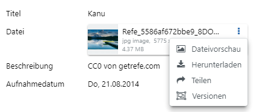
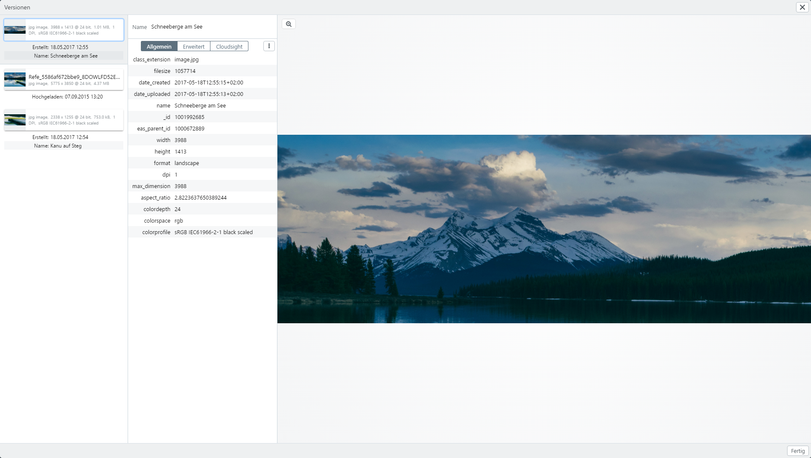

# Datei-Versionen

easydb kann je Datei mehrere Versionen verwalten. Das können zum Beispiel Ausschnitte einer Datei sein oder retuschierte, verbesserte Versionen. Hier handelt es sich nicht um die Vorschau-Versionen. Diese werden automatisch von easydb erstellt und verwaltet.

## Versionen anzeigen

Aus der Detailansicht können Sie über den <i class="fa fa-ellipsis-v"></i> Optionen-Button die Versionen einsehen, die für diesen Datensatz angelegt sind. Über den Editor stehen an dieser Stelle noch Werkzeuge zur Erzeugung von Versionen bereit.

## Versionen erzeugen

* Verwenden Sie <i class="fa fa-upload"></i>, um neue Versionen hochzuladen.
* Verwenden Sie `-`{.button}, um die markierte Version aus der Liste zu entfernen.
* Benutzen Sie die Maus, um per Drag & Drop die Reihenfolge der Versionen zu verändern. Die zuoberste Version ist die *Bevorzugte Version*. Diese Version wird in der Detailansicht und im Editor für die Dateivorschau verwendet.
* Sie können jeder Version einen eigenen Namen geben. Der Name wird nur hier angezeigt.
* Bestätigen Sie Ihre Änderungen mit `Übernehmen`{.button}, um Sie für den Datensatz zu speichern.

## Asset-Tools

|Button|Funktion|Erläuterung|
|--|--|--|
|<i class="fa fa-rotate-left"></i>|Links drehen (je 90° )|Drehen des Bildes nach links. Ein stufenloses Drehen ist zurzeit nicht vorgesehen.|
|<i class="fa fa-rotate-right"></i>|Rechts drehen (je 90° )|Drehen des Bildes nach rechts. Ein stufenloses Drehen ist zurzeit nicht vorgesehen.|
|<i class="fa fa-arrows-v"></i>|Vertikal spiegeln|Das Bild an der vertikalen Achse spiegeln.|
|<i class="fa fa-arrows-h"></i>|Horizontal spiegeln|Das Bild an der horizontalen Achse spiegeln.|
|<i class="fa fa-refresh"></i>|Zurücksetzen|Setzt das Bild in den ursprünglichen Zustand zurück.|
|<i class="fa fa-crop"></i>|Zuschneiden|Starten des Tool zum Zuschneiden. Mit `Erzeuge Version`{.button} können Sie eine neue Version der Datei mit Ihrem Zuschnitt erzeugen. Diese erscheint dann unten in der Liste.|

### Bilder

|Tool|Erläuterung|
|--|--|
|`Zoom`{.button}|Starten der Zoom-Ansicht.|
|`Metadaten`{.button}|Anzeige der unveränderten Metadaten aus der Datei zum Zeitpunkt des Hochladens.|

### Office & PDF

|Tool|Erläuterung|
|--|--|
|`Ansehen`{.button}|Startet die Übersichtsansicht für das PDF.|
|`Metadaten`{.button}|Anzeige der unveränderten Metadaten aus der Datei zum Zeitpunkt des Hochladens.|

### Video

|Tool|Erläuterung|
|--|--|
|`Video`{.button}|Startet den Videomodus zum Abspielen der Datei.|
|`Metadaten`{.button}|Anzeige der unveränderten Metadaten aus der Datei zum Zeitpunkt des Hochladens.|

### Audio

|Tool|Erläuterung|
|--|--|
|`Audio`{.button}|Startet den Audiomodus zum Abspielen der Datei.|
|`Metadaten`{.button}|Anzeige der unveränderten Metadaten aus der Datei zum Zeitpunkt des Hochladens.|

