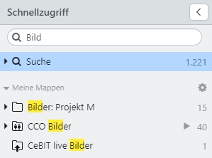
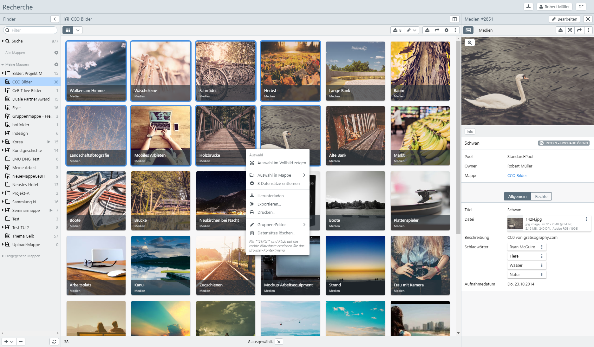

# Schnellzugriff (Gespeicherte Suchen & Mappen)

Über den Schnellzugriff werden Zusammenstellungen von Datensätzen verwaltet. Das sind zum einen dynamische Mappen, wie gespeicherte Suchen und ad hoc Mappen für taggleich bearbeitete Datensätze. Und zum anderen manuelle Zusammenstellungen, wozu eigene und freigegebene Mappen zählen. Mit <code class="button"> < </code> kann der Schnellzugriff ein- und ausgeblendet werden.

## Übersicht im Schnellzugriff

easydb bietet in der Mappenübersicht folgende Mappen an:

|Mappe|Untergeordnet|Erklärung|
|--|--|--|
|<i class="fa fa-search"></i> Suche||Entsprich der aktuellen Anzahl von Datensätzen, die Ihnen in easydb zur Verfügung steht. Aus einer Mappe gelangen Sie über diesen Weg wieder direkt in der Hauptsuche.|
||<i class="fa fa-search"></i> Heute bearbeitet|Enthält die von Ihnen heute bearbeiteten Datensätze. Hierfür wird das aktuelle Tagesdatum verwendet, d.h. 0:00 bis 23:59 des aktuellen Tages. Für komplexere Suchen, die zeitlich weiter zurückgehen, kann eine Abfrage der [Änderungshistorie](../../features/datatypes/datatypes.html#changelog-search) in der [Expertensuche](../../search/search.html#expert) durchgeführt werden.|
||<i class="fa fa-search"></i> Erstellt|Die heute von Ihnen erstellten Datensätze.|
||<i class="fa fa-search"></i>Geändert|Die heute von Ihnen geänderten Datensätze.|
|<i class="fa fa-search"></i> Gespeicherte Suchen||Die Treffer einer Suche können über das Optionen-Menü unter <i class="fa fa-floppy-o"></i> gespeichert und an dieser Stelle wieder erneut aufgerufen werden. Diese Mappe ist dynamisch. Hier werden alle Datensätze gezeigt, die für die Kriterien der gespeichert Suche passen.|
|Meine Mappen|| Vom Benutzer angelegte Zusammenstellungen von Datensätzen. |
|Freigegebene Mappen|| Zusammenstellungen von Datensätzen, die von anderen Benutzern freigegeben wurden. Es gelten die Berechtigungen an der Mappe, die der Ersteller zugewiesen hat.|

### Mappen erstellen und löschen

Eine Mappe kann in der Schnellanzeige über den <code class="button">+</code> erzeugt werden. Markierte Datensätze können dann aus der Trefferanzeige per Drag & Drop in die Mappe gezogen werden. Eine Mappe kann auch aus der Trefferanzeige erstellt werden. Dafür wird das Kontextmenü für markierte Datensätze aufgerufen. Mit <code class="button">-</code> kann eine markierte Mappe wieder entfernt werden.

### Mappe suchen

Über das Suchfeld kann nach Mappen gesucht werden. Die Übereinstimmung der Eingabe im Suchfeld mit einer passenden Mappen wird farbig hervorgehoben. Mappen, die mit der Eingabe nicht übereinstimmen, werden ausgeblendet.

## Mappen im Detail

Unter den dynamischen Such-Mappen erscheinen Ihre eigenen Mappen und von anderen Benutzern freigegebene Mappen. Bei Klick auf <i class = "fa fa-chevron-right"> </i> Meine Mappen oder <i class = "fa fa-chevron-right"> </i> Freigegebene Mappen, werden alle Mappen angezeigt oder verborgen. Halten Sie dabei noch gleichzeitig die Strg-Taste, werden auch alle hierarchisch untergeordneten Mappen in dem Baum geöffnet. Durch Klick auf eine Mappe wird der Inhalt der Mappe rechts im Detail angezeigt. Durch Doppelklick auf einen Datensatz wird rechts daneben die Detailansicht geöffnet. In der Anzeige über dem Mappeninhalt befindet sich der Split-Button <i class="fa fa-columns"></i>, mit dem die [Suche](../find/find.html) neben der Mappe geöffnet wird.

> HINWEIS: Mit Drag & Drop kann die Reihenfolge der Datensätze in der Mappe verändert werden.

### Funktionen

Mit Rechtsklick auf eine Mappe öffnet das Kontextmenü mit Funktionen für die Mappe. Markieren Sie Datensätze in der Mappe und öffnen von hier aus mit der rechten Maustaste das Kontextmenü, werden zusätzlich Funktionen für die Datensätze angezeigt. Über die Toolbar oberhalb der Detailansicht für die Mappe sind die Funktionen ebenfalls aufrufbar.

Für Mappen stehen folgende Funktionen über das Kontextmenü bereit:

|Funktion|Kontextmenü|Erklärung|
|--|--|--|
|<i class="fa fa-search"></i>|In der Suche anzeigen|Erzeugt einen Suchelement in der Suche und zeigt die Inhalt der Mappe als Treffer an. Die Suche kann dann um noch weitere Suchelemente erweitert werden.|
|<i class="fa fa-arrows-alt"></i>|Im Vollbild anzeigen|Zeigt die Inhalte der Mappe in easydb Vollbild an.|
|<i class="fa fa-expand"></i>||Steht im Vollbildmodus zur Verfügung. Öffnet die Ansicht als Browser-Vollbild.|
|<i class="fa fa-download"></i>|Herunterladen...|Lädt die Dateien der Mappe herunter. es öffnet sich ein Auswahldialog, in dem Einstellungen für den Download vorgenommen werden können. |
|<i class="fa fa-sign-out"></i>|Exportieren...|Öffnet das [Export-Menü](../../features/export/export.html) zum Exportieren der Mappe.|
|<i class="fa fa-print"></i>|Drucken...|Öffnet den Drucken-Dialog für alle in der Mappe enthaltenen Datensätze |
|<i class="fa fa-share"></i>|Freigabe...|Öffnet das [Freigaben-Menü](#sharecollection) für die Mappe. Darüber können Sie die Mappe anderen easydb-Benutzern zur Verfügung stellen, die Mappe per E-Mail freigeben oder einen anonymen Link zu der Mappe erzeugen.|
|<i class="fa fa-newspaper-o"></i>|Präsentation|Alle Dateien aus der Mappe werden geladen.|
|<i class="fa fa-edit"></i>|Umbenennen|Umbenennen der Mappe.|
|<i class="fa fa-plus"></i>|Neue Mappe|Erstellt eine neue Mappe. Wenn Sie sich in einer Mappe befinden, können Sie eine Mappe unterhalb dieser erstellen.|
|<i class="fa fa-cogs"></i>|Einstellungen|Öffnet das [Menü](#collectionsettings) im Reiter *Allgemein* für Einstellungen zur Mappe.|
|<i class="fa fa-minus"></i>|Löschen...|Löscht ein Mappe. Die Datensätze in der Mappe werden dabei nicht gelöscht, sondern verbleiben suchbar in der easydb.|

## Freigaben {#sharecollection}

Eine Mappe kann anderen Benutzern freigegeben werden. Dazu gehören:

* Benutzer mit einem easydb Login
* Eine ganze easydb Gruppe
* Benutzer die kein eigenes easydb Login haben können per E-Mail eingeladen werden
* Links für den anonyme Zugriff von Extern

|Funktion| |Erklärung|
|--|--|--|
|<i class="fa fa-plus"></i>|Benutzer/Gruppe/E-Mail|Erstellt eine neue Freigabe für diese Mappe. Suchen Sie den Benutzer, die Gruppe oder die E-Mail für die Sie die Mappe freigeben möchten. Wenn Sie eine E-Mail eingeben, die noch nicht in der easydb hinterlegt ist, haben Sie die Möglichkeit für diese E-Mail einen neuen Benutzer anzulegen. Dazu müssen Sie noch die Sprache für diesen Benutzer festlegen. |
|||Eine Freigabe für die Systemgruppe *Anonyme Benutzer* ermöglicht einen unauthentifizierten Zugriff auf die freigegebenen Inhalte. Dieser Benutzer muss im Rechtemanagement konfiguriert sein. Beim Aufruf von easydb werden die Inhalte dann angezeigt, ohne dass sich der Benutzer dafür anmelden muss. Der Link kann zur Weitergabe genutzt werden. Die Inhalte sind auch ohne den Link erreichbar. |
| |Link erzeugen für externen Zugriff|Für diese Art der Freigabe wird ein Pseudobenutzer mit einer kryptischen ID angelegt und ein Link generiert. Die freigegeben Datensätze sind **nur** über diesen Link erreichbar. Der unauthentifizierte Zugriff auf diese Mappe ermöglich dem Benutzer auf die freigegeben Daten zuzugreifen, ohne sich anmelden zu müssen oder eine E-Mail preis zu geben. Der Link muss manuell z.B. per E-Mail oder anders an den Adressaten weitergeben werden. Klicken Sie auf <i class="fa fa-share"> </i>, um den Link anzuzeigen und für die Weitergabe zu kopieren.|
|<i class="fa fa-minus"> </i>||Entfernt die Freigabe. Sie müssen vorher die entsprechende Zeile markieren.|
|Vordefinierte Berechtigung||In diesem Pulldown wählen Sie aus, welches Recht für diese Freigabe erteilt wird. Beachten Sie, dass diese Rechte vom Administrator der easydb [vorkonfiguriert](../../../rightsmanagement/presets/presets.html) werden. Es wird der Name der Berechtigung angezeigt, nicht jedoch die Einstellungen im Einzelnen. Für jede Berechtigung kann der Administrator einen erklärenden Text hinterlegen, der als *Tooltip* erscheint, wenn Sie mit dem Mauszeiger länger auf der jeweiligen Berechtigung verweilen.|
|Ende||Terminierung der Freigabe. Geben Sie das Datum ein, an dem die Freigabe enden soll. Das Datum kann auch mit einer Uhrzeit angegeben werden. Die Eingabe erfolgt ohne Trennzeichen im Format dd.mm.yyyy & hh:mm (00:00-23:59), z.B. *12.12.2012 12:12*. |
|E-Mail||Wenn gesetzt, wird der Benutzer oder die Gruppe per E-Mail über die Freigabe informiert. Sie können im Experten-Menü, eine persönliche Nachricht ergänzen. Beachten Sie, dass diese E-Mail verschickt wird, nachdem Sie gespeichert haben. Beim nächsten Aufruf des *Sharing-Popover* erscheint die Checkbox wieder leer. So haben Sie die Möglichkeit erneut eine E-Mail zu verschicken.|
|<i class="fa fa-share"> </i>||Generierter Link. Für Freigaben des Typs "Link erzeugen für externen Zugriff" sind die geteilten Datensätze nur über diesen Link erreichbar. Für andere Typen von Freigaben, kann der Link optional verwendet werden. Die Freigabeeinstellungen müssen immer erst gespeichert werden, bevor der Link kopiert wird. |
|<i class="fa fa-bars"> </i>||Zugang zum Experten-Popover (siehe nächster Abschnitt) für individuelle Berechtigungsvergabe.|

>HINWEIS: Freigaben wirken sich auch auf alle untergeordneten Mappen aus, wenn für diese nicht *Berechtigungen übergeordneter Mappen ignorieren* aktiviert ist. Die Freigabeeinstellungen müssen gespeichert werden, bevor der Link zur Freigabe kopiert wird.

### Experten-Popover für Freigaben

Freigaben können im Experten-Popover mit zusätzlichen Funktionen ausgestattet werden. Klicken Sie dazu bei der Freigabe auf <i class="fa fa-bars"></i>, um das Experten-Popover zu öffnen.

|Einstellung|Erklärung|
|--|--|
|Aktiv|Wenn gesetzt ist die Freigabe aktiv. Nutzen Sie diese Checkbox, um eine Freigabe vorrübergehend zu de-aktivieren. Benutzer werden über diesen Vorgang nicht informiert.|
|Benutzer/Gruppe/E-Mail/Anonym|Hier wird angezeigt, für wen die Freigabe gilt. Bei anonymen Freigaben erscheint hier ein Hash-Key der keine weitere Bedeutung hat und der Absicherung des Zugriffs dient.|
|Beginn|Zeitpunkt wann eine Freigabe aktiv wird. Wenn nicht gesetzt ist die Freigabe sofort nach dem Speichern aktiv.|
|Ende|Zeitpunkt bis wann eine Freigabe aktiv bleibt. Wenn nicht gesetzt bleibt die Freigabe immer aktiv.|
|Persistent|Mappen können mit der Checkbox *Rechte-Zeilen übergeordneter Mappen ignorieren* eigene Freigaben deklarieren. Wenn Sie *Persitent* gesetzt haben, kann diese Freigabe in untergeordneten Mappen auch durch diese Einstellung nicht mehr de-aktiviert werden.|
|Link zum Weitergeben|Für anonyme Freigaben erscheint hier ein Link der weitergegeben werden kann. Klicken Sie auf <code class="button">Goto</code>, um den Link in einem neuen Browser-Fenster auszuprobieren.|
|Recht|Wählen Sie hier das Recht aus (siehe bei [Freigaben](#sharecollection)).|

> HINWEIS: Wenn Sie über das System-Recht *root* oder *allow_custom_enabled_in_preset_enabled_acl* verfügen, werden die [Rechte](../../../rightsmanagement/rightsmanagement.html#rights) im Einzelnen angezeigt.

## Einstellungen {#collectionsettings}

Der Dialog für Einstellung zur Mappe ist derselbe wie bei Sharing, nur das der Reiter *Allgemein* aktiv ist.

### Allgemein

Auf diesem Reiter sind allgemeine Einstellungen für die Mappe verfügbar.

|Einstellung|Erklärung|
|--|--|
|Anzeigename|Anzeigename der Mappe. Mehrsprachig.|
|Beschreibung|Beschreibung der Mappe. Mehrsprachig. Wird dem Benutzer beim Betrachten der Mappe im Mappe-View angezeigt.|
|Link zu dieser Mappe|Der Deep-Link zu dieser Mappe. Benutzen Sie den Link, wenn Sie für sich selber ein Bookmark auf diese Mappe setzen wollen oder jemand einen Link weitergeben wollen der ebenfalls Zugriff auf diese Mappe hat.|

### Hochladen (Hotfolder)

Mappen können genutzt werden, um direkt Dateien in die easydb zu laden. Dazu können Sie eine Mappe entsprechend konfigurieren (Hotfolder). Die Einstellungen hier wirken sich auf alle untergeordneten Mappen aus. Sie können in den untergeordneten Mappen verändert, aber nicht mehr abgeschaltet werden.

>HINWEIS: Dateien können per Drag & Drop von Ihrem Computer in die Mappe (innerhalb der Übersicht) oder in die Detail-Anzeige der Mappe gezogen werden. Die Dateien werden bei diesem Vorgang in die easydb kopiert, d.h. die Datei auf Ihrem Computer bleibt erhalten.

Da die easydb mit einem flexiblen Datenmodell arbeitet, müssen Sie konfigurieren in welchem Objekttyp, Pool und in welchem Feld die hochgeladenen Dateien landen sollen. Dabei kann ein Import-Mapping konfiguriert werden. Um einen Workflow zu starten können Sie den Datensätzen noch voreingestellte Tags mit auf den Weg geben.

>HINWEIS: Für jede hochgeladene Datei wird genau ein Datensatz erzeugt. Mappen die für den Upload konfiguriert sind erscheinen mit einem Upload-Symbol <i class="fa fa-upload"></i>.

|Einstellung|Erklärung|
|--|--|
|Objekttyp|Der Objekttyp für den der Datensatz erzeugt wird.|
|Pool|Der Pool mit dem der Datensatz verknüpft wird.|
|Maske|Wählen Sie die Maske aus, um ein Feld festzulegen, mit welchem die Datei verknüpft wird.|
|Feld|Wählen Sie das Feld aus, mit dem die Datei verknüpft wird. Hierbei wird auch der Import von [Serienbildern und Versionen](../../new_objects/new_objects.html#batch) unterstützt.|
|Mapping|Das Mapping welches für den Import verwendet wird.|
|Tags|Legen Sie die *Tags* fest, die für den neu erzeugten Datensatz gesetzt werden.|

