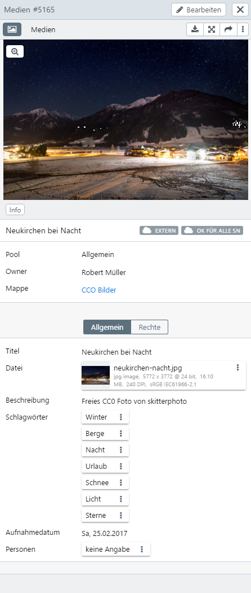
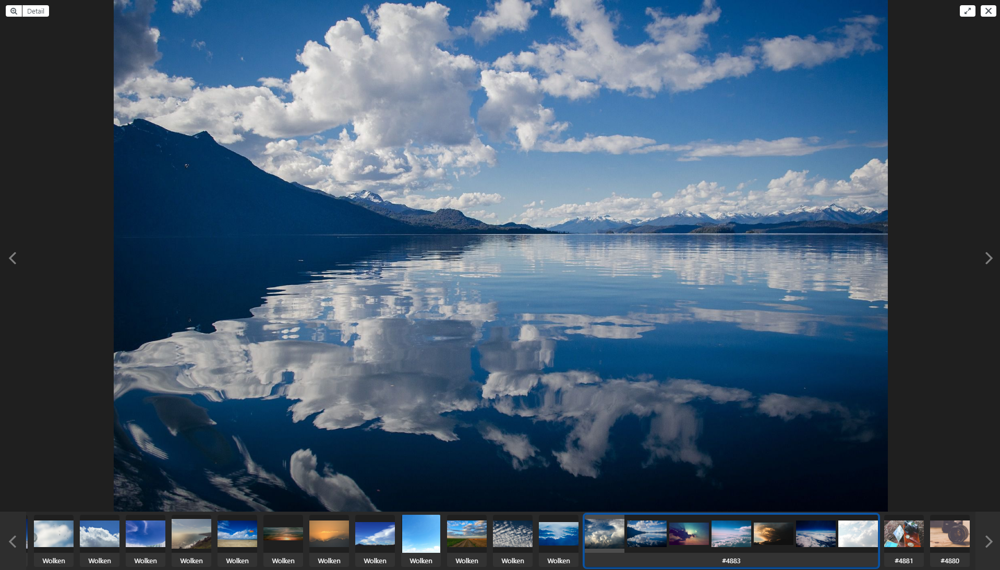

# Detailansicht

Die Detailansicht für einen Datensatz erscheint wahlweise rechts in der Sidebar oder im Vollbild.

## Sidebar

In der Sidebar erscheint im oberen Bereich die [Dateivorschau](../../datatypes/datatypes.md#tools), die Sie mit <i class="fa fa-image"></i> ein- und ausschalten können. Dieser Zustand wird in Ihrem Benutzerprofil gespeichert.

|Button|Erläuterung|
|--|--|
|<i class="fa fa-arrows-alt"></i>|Öffnet das Detail im Vollbild.|
|<i class="fa fa-pencil"></i><code class="button">Bearbeiten</code>|Öffnet den Editor in der Sidebar.|
|<i class="fa fa-times"></i>|Schließt die Sidebar.|
|<i class="fa fa-download"></i>|Öffnet zum Export des Datensatzes einen Auswahl-Dialog für die Größe der Datei (siehe unten).|
|<i class="fa fa-image"></i>|Schaltet die Vorschau ein und aus.|
|<code class="button">Medien</code>| Stehen für den Datensatz mehrere Masken zur Verfügung, erscheint diese Angabe als Auswahlfeld. Berechtigte Benutzer können die Maske über dieses Feld wechseln. Steht nur eine Maske zur Verfügung, wird diese hier als nicht aktives Feld angezeigt.|
|| Erscheint bei hierarchischen Objekttypen und blendet neben der Detailansicht den Hierarchiebaum ein und aus. |

### Herunterladen

Wählen Sie für das zu herunterzuladende Datei-Feld eine Größe des Downloads aus. Wählen Sie eine Option für den Export des Metadatenprofils und für den Dateinamen. Es kann auch ein eigener Dateiname eingetragen werden. Hierfür können die Ersetzungen verwendet werden, die auch für den jeweiligen Objekttypen unter [*Dateinamen für Export und Download*](../../../rightsmanagement/objecttypes/objecttypes.md) zur Verfügung stehen.

Der Download erfolgt als ZIP-Datei.

## Vollbild

In der Vollbildansicht können Listen durchgeblättert werden. Am unteren Rand gibt es eine Übersicht mit Vorschaubildern. Oben links können Sie mit <code class="button">Detail</code> weitere Informationen zum Datensatz anzeigen, mit <i class="fa fa-expand"> </i> können Sie das Vollbild auf den ganzen Bildschirm vergrößern und mit <i class="fa fa-times"> </i> schließen Sie die Vollbildansicht. Über <i class="fa fa-search-plus"> </i> oben links wird der Zoomer aktiviert, um Details vergrößert anzuzeigen.

Mit <i class="fa fa-chevron-left"> </i> und <i class="fa fa-chevron-right"> </i> neben dem angezeigten Datensatz kann zum nächsten Datensatz geblättert werden. Die Vorschauleiste kann über die entsprechenden Symbole am Rand nach links und rechts bewegt werden. Datensätze, in denen andere Assets verlinkt sind, werden wie im Screenshot gruppiert durch eine Umrandung angezeigt.

> HINWEIS: Wenn das Vollbild Icon in der Vollbildansicht sowohl im Asset Browser als auch im Asset Detail grau ( = deaktiviert) ist, dann hat der Nutzer bei seinem Browser den Vollbildmodus nicht aktiviert.

## Teilen

Über <i class="fa fa-share"></i> oben in der Datailansicht können Sie den Datensatz oder aus dem entsprechenden Feld die Datei, die mit dem Datensatz verknüpfte ist, teilen. Nähere Informationen zum Teilen und Freigeben über Links finden sie im Kapitel [Deep Links](../deeplinks/deeplinks.md).
