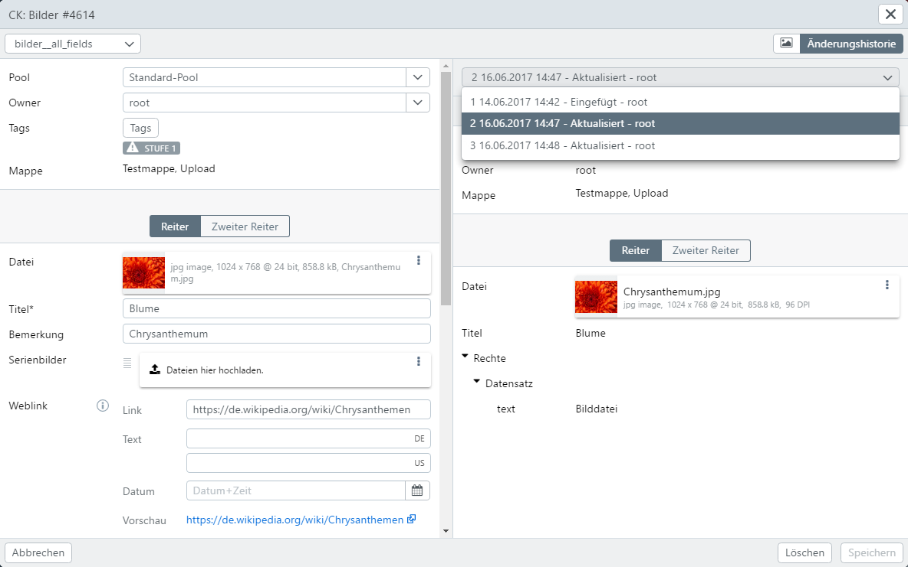

# Eingabe

Die Eingabe, das Verändern, Neu-Anlegen etc. von Datensätzen wird in easydb im sogenannten **Editor** vorgenommen. Je nachdem von wo der Editor aufgerufen wird, wird er in verschiedenen Größen angezeigt. Funktional unterscheiden sich die verschiedenen Größen nur wenig.

|Editor|Aufruf|Datei-Vorschau|Historie|
|--|--|--|--|
|Neu-Editor|Durch Klick auf [Neue Datensätze](/webfrontend/datamanagement/new_objects/new_objects.html) im Hauptmenü oder durch Drag & Drop lokaler Dateien in die Rechercheansicht|X|-|
|Sidebar|Durch Klick auf einen Datensatz aus dem Suchergebnis oder aus der Mappen-Vorschau.|X|-|
|Vollbild|Bei der Benutzung des Kontext-Menüs aus dem Suchergebnis heraus und bei *Listen* im Administrations-Bereich.|X|X|
|Gruppeneditor|Kontext-Menü nach Selektion von mehreren Datensätzen im Suchergebnis.|-|-|
|Popover|Kleiner Editor, erreichbar aus Experten-Suche und aus den anderen Editoren, wenn verlinkte Datensätze gesucht werden.|-|-|

Die Datei-Vorschau im Editor kann über <i class="fa fa-picture-o" aria-hidden="true"></i> aktiviert und deaktiviert werden. Sie präsentiert alle Dateien eines Datensatzes (soweit in der Maske angegeben) in einem Vorschau-Browser. Sie stellt z.B. [Zoomer](../../features/datatypes/datatypes.html#tools) und [Office-Viewer](../../features/datatypes/datatypes.html#tools) zur Verfügung.

> HINWEIS: Je nach Datentyp gibt es unterschiedliche Ausprägungen von Eingabefeldern. Mehr Informationen dazu finden sie [hier](../../features/datatypes/datatypes.html).

## Funktionen im Editor {#editor}

|Button|Erklärung|
|--|--|
|<code class="button">Speichern</code>|Speichert den Datensatz oder die Datensätze (Neu) oder aktualisiert die Datensätze (Gruppeneditor).|
|Pflichtfeld|Pflichtfelder müssen ausgefüllt sein, um speichern zu können. Besteht ein Pflichtfeld aus mehreren Feldern für Mehrsprachigkeit, reicht es aus, wenn eine Sprache (=Feld) ausgefüllt wird.|
|Kommentar (Checkbox)|Wenn gesetzt, wird vor dem Speichern ein Kommentar abgefragt, der dann in der Historie angezeigt wird. Wenn in der Maske vorgesehen, kann der Kommentar verpflichtend sein und Sie können die Checkbox nicht abwählen.|
|<code class="button">Kopieren</code>|Öffnet eine ungespeicherte Kopie des aktuellen Datensatzes zur Bearbeitung als neuen Datensatz.|
|<code class="button">Löschen</code>|Löscht den aktuellen Datensatz. Beachten Sie, dass in der aktuellen easydb Version gelöschte Datensätze nicht wieder auffindbar sind. easydb speichert aber alle alten Versionen des gelöschten Datensatzes.|
|<code class="button"> < </code> & <code class="button"> > </code>|Blättern Sie zum vorherigen oder nächsten Treffer. Bei Neu-Eingabe springen Sie damit in der linken Leiste einen Datensatz vor oder zurück.|
|<code class="button">Dateivorschau</code>|Schaltet die Datei-Vorschau an oder aus.|
|<code class="button">Änderungshistorie</code>|Blendet die Änderungshistorie ein oder aus (siehe unten).|
|<code class="button">Maske</code>|Schaltet die Maske um, ggfs. müssen Sie vorher speichern, um Ihre Daten nicht zu verlieren.|
|<i class="fa fa-thumb-tack"> </i>|Verwenden und Erstellen von Vorlagen. Wenn Sie Vorlagen gespeichert haben, steht über dieses Menü die Liste verfügbarer Vorlagen bereit.   *Als Vorlage speichern...*: Es wird eine Vorlage auf Basis dieses Datensatzes erstellt. Es öffnet ein Dialog, in dem ein Name für die Vorlage vergeben wird.   *Anpassen*: Name bestehender Vorlagen anpassen oder Vorlagen löschen |

> HINWEIS: Vorlagen können nur pro Benutzer und je Objekttyp und/oder Maske gespeichert werden. Wenn eine Vorlage mehreren Benutzern zur Verfügung stehen soll, müssen Vorlagen auf Poolebene definiert werden. Hierdurch haben Benutzer Zugriff auf allgemeine Vorlagen und können diese in ihre eigene Vorlagenliste übernehmen.

## Änderungshistorie {#history}

In der Änderungshistorie lassen sich frühere Versionen des Datensatzes einblenden. Angezeigt wird wer wann den Datensatz geändert hat und der Kommentar, sofern einer angelegt wurde.

# Bearbeiten im Gruppeneditor {#groupedit}

Im Gruppeneditor können Sie für einen Objekttyp gleichzeitig bis zu 1000 Datensätze aktualisieren. Dafür können Sie einzelne oder mehrere Felder auswählen. Die Aktualisierung je Datensatz beschränkt sich dann auf die angegebenen Felder, andere Felder bleiben von der Aktion unberührt.

Für die Bearbeitung im Gruppeneditor müssen Sie eine Auswahl von mehr als einem Datensatz treffen. Der Gruppeneditor steht dann über das Kontextmenü zur Verfügung. Enthält die Auswahl unterschiedliche Objekttypen, kann der Gruppeneditor im Kontextmenü über eine Auswahlliste je Objekttyp gestartet werden.

Die Eingabe der Felder folgt denselben Regeln, wie die Eingabe bei einzelnen Datensätzen. Neben den allgemeinen Funktionen des Editors bietet der Gruppeneditor noch einige spezielle Funktionen:

|Funktion|Erklärung|
|--|--|
|Vorlage|Ist das erste Element links in der Anzeige der Auswahl. Über die Vorlage können alle Datensätze, die unterhalb der Vorlage gelistet sind, bearbeitet werden.|
|Ckeckbox|Vor jedem Eingabefeld ist eine Checkbox, die aktiviert werden muss, damit die Änderungen für alle Datensätze beim Speichern übernommen werden. Je Feld stehen unterschiedliche Auswahloptionen für das Hinzufügen, Ersetzen oder Entfernen von Eingaben zur Verfügung. |
|<code class="button"> < </code> & <code class="button"> > </code>|Die Paginierung erscheint, wenn mehr als 50 Datensätze für die Gruppenbearbeitung ausgewählt wurden.|
|<i class="fa fa-minus"> </i>| Entfernt den markierten Datensatz aus dem Gruppeneditor. Es kann jeweils nur ein Datensatz aus dem Gruppeneditor entfernt werden. Das markieren mehrerer Datensätze wird in diesem Modus nicht unterstützt.|
|<i class="fa fa-clipboard"> </i>|Übernimmt die Einträge des markierten Datensatzes in die Vorlage.|
|<i class="fa fa-thumb-tack"> </i>|Speichert die Vorlage. Gespeicherte Vorlagen stehen dann bei neuen Arbeitsvorgängen im Gruppeneditor an dieser Stelle über das Auswahlmenü zur Verfügung. Vorlagen können nur pro Benutzer und Maske gespeichert werden. Beachten Sie auch den Hinweis unter [Funktionen im Editor](/webfrontend/datamanagement/search/editor/editor.html#editor)  |

## Rechte-Listen

|Einstellung|Erklärung|
|--|--|
|Berechtigungen hinzufügen|Fügt die neu eingegebenen Rechte-Zeilen je Datensatz hinzu.|
|Berechtigungen ersetzt|Ersetzt die angegebenen Rechte-Zeilen je Datensatz. Dabei wird nur der Benutzer bzw. die Gruppe verglichen. *If the who attribute is empty, its rights will be appended to all existing ACL entries*|
|Berechtigungen entfernen|Entfernt die angegebenen Rechte-Zeilen je Datensatz. Dabei wird nur der Benutzer bzw. die Gruppe verglichen. *If the who attribute is empty, its rights will be appended to all existing ACL entries*|
|Alle Berechtigungen entfernen|Entfernt alle Rechte-Zeilen an jedem Datensatz.|

## Tags

|Einstellung|Erklärung|
|--|--|
|Tag(s) hinzufügen|Tags die noch nicht gesetzt sind, werden je Datensatz gesetzt.|
|Tag(s) ersetzen|Die angegebenen Tags ersetzen die bestehenden Tags je Datensatz.|
|Tag(s) entfernen|Die angegebenen Tags entfernen.|
|Alle Tags entfernen|Alle Tags in jedem Datensatz werden entfernt.|

## Mehrfach-Felder

|Einstellung|Erklärung|
|--|--|
|Am Ende hinzufügen|Fügt die Mehrfach-Felder-Zeilen ans Ende bei jedem Datensatz hinzu.|
|Am Anfang hinzufügen|Fügt die Mehrfach-Felder-Zeilen am Anfang bei jedem Datensatz hinzu.|
|Alle ersetzen|Fügt die Mehrfach-Felder-Zeilen jedem Datensatz hinzu, löscht vorher alle bestehenden.|
|Entfernen, wenn gesetzt|Entfernt Mehrfach-Felder am Datensatz, wenn die gesetzten Felder identisch sind.|
|Alle entfernen|Entfernt alle Mehrfach-Felder am Datensatz.|

## Boolesche Variablen (Ja/Nein-Felder)

Boolesche Variablen mit Ja/Nein werden über eine Checkbox bedient. Über Masken lässt sich definieren, wie Einträge dieses Feldtyps in der Detailansicht angezeigt werden. Siehe hierzu die Einstellung in [Optionen](../../../administration/datamodel/mask/mask.md#definition) für Ja/Nein-Felder.

