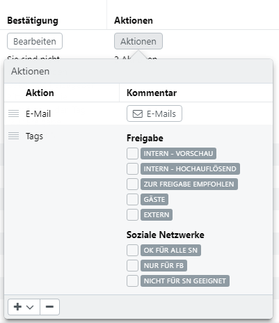
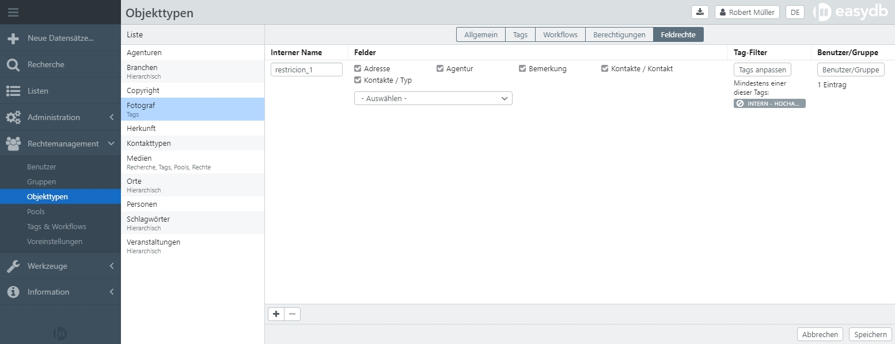

# Objekttypen

Mit den Einstellungen für Objekttypen im Rechtemanagement können Ausgabeoptionen und Zugriffsberechtigungen gesteuerte werden. Je nach Konfiguration im Datenmodell stehen unterschiedliche Tabs (Reiter) für Einstellungen zur Verfügung. Beachten Sie hierfür die Hinweise in den Erläuterungen zu den jeweiligen Einstellungen.

Objekttypen werden von Administratoren im [Datenmodell](/webfrontend/administration/datamodel/objecttype/objecttype.html) angelegt. Änderungen in der Entwicklungsumgebung für das Datenmodell müssen aktiviert werden, damit sie produktiv verwendet werden können. Das Aktivieren der Änderungen setzt einen kompletten Neubau des easydb-Daten-Index in Gang und kann ggfs. einige Zeit in Anspruch nehmen. Für Änderungen im Rechtemanagement ist dieser Prozess nicht nötig.

> HINWEIS: Beachten Sie, dass bei Änderungen an bestehenden Objekttypen es ggfs. passieren kann, dass betroffene Datensätze Benutzern nicht angezeigt werden könne, bis der Neubau des easydb-Daten-Index abgeschlossen ist.


## Allgemein

|Einstellung|Option|Erläuterung|
|--|--|--|
|Ansprechpartner| |Der Benutzer, der als Ansprechpartner für Datensätze dieses Objekttypen in der Recherche-Ansicht angezeigt wird. Wenn ein Ansprechpartner angegeben wird, wird der Name im Info-Dialog neben dem Objekttyp in der Auswahl neben der Suchleiste angezeigt.|
|Beschreibung||Hier kann eine Beschreibung für den Objekttyp hinterlegt werden, auch mehrsprachig, wenn konfiguriert. Für Benutzer wird die Beschreibung neben dem Objekttyp im Auswahlmenü für Pools und Objekttypen als Information angezeigt.|
|Standard Ein- und Ausgabe||Wenn die Checkbox deaktiviert ist, können sie hier die Reihenfolge der Masken verändern, um eine Priorität bei der Wahl der Standard-Maske vornehmen. Beachten Sie, dass mindestens eine Maske überhalb der Linie liegen muss. Für Benutzer wird über das Rechtemanagement zunächst eine Liste der erlaubten Masken erstellt. Die hier angegebene Reihenfolge wirkt sich auf die Standard-Maske aus, die benutzt wird, um das Suchergebnis anzuzeigen. Falls die Checkbox aktiv ist, wird die Standard-Maske aus dem Datenmodell verwendet. Beachten Sie, dass diese Einstellung für Objekttypen am Pool noch geändert werden kann, wenn für diesen Objekttyp Pool-Management aktiviert ist.|
|Export-Profil für Dublin Core|Kein Profil|Beim Export aus diesem Objekttyp werden keine Metadaten geschrieben.|
| |Mapping aus dem Profil-Management|Beim Export wird das angegebene Mapping verwendet.|
|Export-Profil für Bilder|Kein Profil|Beim Export von Bilder aus diesem Objekttyp werden keine Datei-Metadaten (XMP, EXIF, IPTC) geschrieben.|
| |Mapping aus dem Profil-Management|Für den Export wird das angegebene Mapping verwendet. Bestehende Metadaten werden dabei überschrieben.|
|Import-Profil für Bilder|Kein Profil|Beim Import von Bilder werden keine Datei-Metadaten (XMP, EXIF, IPTC) in easydb geschrieben.|
|In Schnellanzeige anzeigen||Kann für Nebenobjekttypen aktiviert werden. Der Nebenobjekttyp erscheint dann als [Kategoriebrowser](../../datamanagement/search/quickaccess/category/category.html) in der Schnellanzeige. |
| |Mapping aus dem Profil-Management|Für den Import wird das angegebene Mapping verwendet. |
|Dateinamen für Export und Download|Name des Datenbankfeldes|Beim Export und Download werden Dateien in dem festgelegten Format benannt. Durch Klick auf <code class="button">Ersetzungen anzeigen</code> können Sie sehen, welche Übersetzungen für einen Dateinamen zur Verfügung stehen. Bei einem Objekttyp *bilder* könnte der Dateiname beispielsweise so festgelegt werden: Für Textfelder gilt ```Meine-Easydb-%bilder.titel%``` und für Linkspalten gilt ```Meine-Easydb-%bilder.lk_copyright_id._standard.1.text%```. |
||Ersetzungen|siehe *Erweiteret Einstellungen* [Ersetzungen für Dateinamen](../../datamanagement/search/export/export.html)|


## Tags {#tags}

Die Verfügbarkeit von Tags kann grundsätzlich easydb-weit angepasst werden (siehe [Tags & Workflows](/webfrontend/rightsmanagement/tags/tags.html)). Wenn Tags für einen Objekttyp ohne Pool aktiviert sind, wird dies in der Liste unterhalb, des Objekttypen angezeigt. In der Detailanzeige für den Objekttyp steht der Reiter *Tags* zur Verfügung. Damit greifen für den Objekttyp die easydb-weit definierten Tags (siehe [Tags & Workflows](/webfrontend/rightsmanagement/tags/tags.html)). Um individuelle Anpassungen vorzunehmen, muss die Checkbox "Eigene Tags-Liste" unten rechts aktiviert werden. Tags, die allgemein das Merkmal "persistent" tragen, können hier nicht geändert werden. Für alle anderen Tags können Sie einzeln definieren, ob der Tag aktiv sein soll und damit für Datensätze dieses Objekttypen zur Auswahl steht oder ob er immer automatisch gesetzt werden soll, wenn ein neuer Datensatz für den Objekttyp angelegt wird. Dafür aktivieren sie die Checkbox "Voreinstellung". Der Tag kann in dem Fall manuell am Datensatz entfernt werden.

> HINWEIS: Tags und Workflows sind für einen Objekttyp nur dann verfügbar, wenn der Objekttyp kein aktiviertes Pool-Management hat und Tag-Management aktiviert ist.


|Einstellung|Erläuterung|
|--|--|
|Eigene Tags-Liste|Um das globale Tag-Management zu überschreiben, muss diese Checkbox gesetzt sein. Beachten sie, dass Tags die als *Persistent* markiert wurden, nicht überschrieben werden können.|
|Aktiv|Muss gesetzt sein, damit der Tag für diesen Objekttyp aktiv ist.|
|Voreinstellung|Wenn gesetzt dann ist dieser Tag für neue Datensätze dieses Objekttyps standardmäßig aktiv.|
|Persistent|Wenn gesetzt kann der Tag in untergeordneten Pools nicht mehr überschrieben werden. Nur in [Rechtemanagement&nbsp;&gt;&nbsp;Pools](../pools/pools.html) verfügbar.|

## Workflows {#workflows}

Grundsätzlich sind die Workflows in [Tags & Workflows](../tags/tags.html#workflows) beschrieben.

|Einstellung| Erläuterung|
|--|--|
|Eigener Workflow|Wenn gesetzt werden alle Workflows überschrieben, die in [Tags & Workflows](../tags/tags.html#workflows)) nicht auf *Persistent* gesetzt sind. Wenn nicht, ergänzen die hier festgelegten Workflows die Globalen.|


### Aktion E-Mail 

Bei der Aktion E-Mail wird an Benutzer oder/und Gruppen eine E-Mail geschickt, die die Operation auf dem Datensatz protokolliert. Sie können mehrere Empfänger eingeben.

|Einstellung|Erläuterung|
|--|--|
|Empfänger|Benutzer oder Gruppe(n).|
|Betreff|Der Betreff der E-Mail.|
|Nachricht|Der Text der E-Mail.|
|Sammelversand|Wenn gesetzt, erhält der Benutzer diese E-Mail als Teil seiner gebündelten E-Mails, die für einen Workflow versendet werden (siehe auch Zeitplan im Benutzermanagement). Ohne Sammelversand erhält der Benutzer die E-Mail sofort.|

### Aktion Tag setzen/entfernen

Sie können als Aktion beliebige Tags setzen oder entfernen. Klicken Sie dazu auf den jeweiligen Tag. Mehrfaches klicken schaltet den Tag um zwischen Plus (Tag setzen), Minus (Tag entfernen) und ohne Symbol (nichts mit dem Tag machen). Nachdem setzen der Tags ist der Workflow abgeschlossen, es werden bezogen auf diese Tag-Änderung keine weiteren Workflows angestossen.



## Berechtigungen

Berechtigungen an Objekttypen ohne Pool-Management  Hier stellen Sie ein, welche Rechte Benutzer und Gruppen an Datensätzen haben, die von diesem Objekttyp sind.

Eine Übersicht über die Rechte finden Sie [hier](../rightsmanagement.html#rights).


## <a name="masks"></a>Ein- und Ausgabe

easydb benutzt zur Suche einen Index. Dieser Index wird immer dann aktualisiert, wenn ein Benutzer einen Datensatz abspeichert oder löscht. In diesen Fällen wird nur der neue Datensatz im Index aktualisiert. Wenn ein Datenbank-Schema aktiviert wird, dann wird der gesamte Index neu berechnet. In der Zeit des Neuberechnens kann es sein, dass ein Benutzer in seinem Suchergebnis einen alten Datensatz findet. Im Editor werden aber immer aktuelle Datensätze angezeigt.

Der Index-Dienst erstellt je Maske je Datensatz ein Index-Dokument. Wenn ein Objekttyp 3 Masken hat, dann liegt im Index für jede Maske ein eigenes Index-Dokument.

Grundsätzlich wird ein Datensatz in seiner aktuellsten Version in den Index geschrieben. Ist das nicht gewünscht, kann in dem Reiter *Ein- und Ausgabe* eine abweichende Version bestimmt werden. Die Version wird über einen Tagfilter ermittelt. Die letzte Version des Datensatzes auf die der Tagfilter passt, wird benutzt, um sie im Index abzulegen. Wenn kein Datensatz passt, wird der Datensatz übersprungen und nicht in den Index geschrieben. Benutzer die beispielsweise nur auf eine eingeschränkte Maske Zugriff haben, finden den Datensatz in dem Fall nicht.

> HINWEIS: Einstellungen für die Ein- und Ausgabe stehen nur für Objekttypen zur Verfügung, für die mehrere Masken im Datenmodell definiert sind.

### Beispiel

Ein Beispiel soll das verdeutlichen. Wir haben im System zwei Masken *Standard* und *Internet* und zwei Tags *Internet* und *Gesperrt* angelegt.


#### Einstellung im Reiter Ein- und Ausgabe

|Ein- und Ausgabe|Tagfilter|
|---|---|
|Standard|*Kein Tagfilter möglich*|
|Internet|Tagfilter: ALL: *Internet*, NOT: *Gesperrt*|

#### Angelegte Tags

|Tag|Typ|Bemerkung|
|--|--|--|
|Internet|Individual||
|Gesperrt|Alle Versionen|Das ist wichtig, *Alle Versionen* strahlt auf alle Versionen des Datensatzes aus.|

#### Verlauf der Datensatz-Eingabe

Im vorliegenden Beispiel wird ein Datensatz von der Version 1 bis 6 jeweils mit verschiedenen Tags versehen. Je nach gesetztem Tag, wird er in der Maske *Internet* indiziert oder nicht.

|Version|Internet<br>*Individual*|Gesperrt<br>*Alle Versionen*|Bemerkung|
|---|--|--|--|
|6|X|-|Der Datensatz wurde entsperrt, jetzt wird für die Maske *Internet* die **Version&nbsp;5** indiziert, weil der Tag *Gesperrt* für alle Versionen gilt.|
|5|X|X|Der Datensatz ist wieder komplett gesperrt, aber jetzt ist der *Internet*-Tag noch an.|
|4|X|-|Der Datensatz wurde wieder freigegeben. Für die Maske *Internet* wird jetzt die **Version&nbsp;2** indiziert.|
|3|-|X|Der Datensatz in der Maske *Internet* wird nicht indiziert, weil der Tag *Gesperrt* gesetzt ist.|
|2|X|-|Der Datensatz wurde freigegeben. Die **Version 1** wird für die Maske *Internet* indiziert.|
|1|-|-|Der Datensatz ist nicht freigegeben und nicht über die Maske *Internet* indiziert.|

## Feldrechte {#fieldrights}

Mit den Feldrechten können innerhalb eines Objekttyps Rechte an einzelne Felder für Benutzer oder Benutzergruppen definiert werden. Gleichzeitig werden für allen anderen Benutzern oder Benutzergruppen diese Felder ausgeblendet. Die Feldrechte können auch an Tags geknüpft werden, wenn Tag-Management für den Objekttyp aktiv ist.



|Eingabe|Erläuterung|
|--|--|
|Interner Name|Datenbankname für das Feldrecht. Es handelt sich dabei um die technische Bezeichnung des Feldes. Dieses Feld muss ausgefüllt werden.|
|Felder|Über das Dropdown Menü werden die Felder gewählt, die ausgeblendet werden sollen. Die ausgeblendeten Felder werden mit einer Checkbox angezeigt und erscheinen im Dorpdown deaktiv (ausgegeraut). Aller weiterhin sichtbaren Felder werden, sind im Dropdown als aktiv markiert. |
|Tag-Filter|Wenn Tag-Filter für den Objekttyp aktiv sind, kann hier eine Bedingung gewählt werden, unter der die Einschränkung in Kraft tritt.|
|Benutzer/Gruppe|Hier können ein oder mehrere Benutzer oder Gruppen eingegeben werden, die das Feldrecht an den definierten Feldern gelten soll. Allen anderen Benutzer und Benutzergruppen wird hierdurch das Recht auf diese Felder entzogen. Ausnahmen können mit "Feldrechte ignorieren" über die [Systemrechte](../rightsmanagement.html#aclsystem) für Benutzer und Gruppen hinzugefügt werden. |

> HINWEIS: Über die Feldrechte kann eine Verfeinerung der Sichtbarkeit von Feldern für Benutzer oder Gruppen vorgenommen werden. Komplexe Feldkonfigurationen für Objekttypen sowie die Ein- und Ausgabeoptionen für die Felder werden auf Ebene der Objekttypen und Masken im [Datenmodell](../../administration/datamodel/datamodel.html) vorgenommen.

