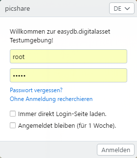

# Anmeldeseite

## Anmeldemaske

Nach dem Aufrufen der easydb im Webbrowser erscheint die Anmeldeseite.

## Eingabe

|Login|Erklärung|Details|
|--|--|--|
|Login|Geben Sie hier Ihren Benutzernamen ein.||
|Passwort|Geben Sie hier Ihr Passwort ein.||
|Passwort vergessen| Falls Sie Ihr Passwort vergessen haben, öffnet sich hier ein neuer Dialog.||
||Dialog: Passwort vergessen?|Geben Sie hier Ihren Benutzernamen oder Ihre hinterlegte E-Mail-Adresse ein. Über 'Zugang senden' wird Ihnen ein Link mit neunem Zugangs-Code an die hinterlegte E-Mail-Adresse geschickt. Folgen Sie dem Link in der E-Mail und vergeben Sie dann Ihr neues Passwort.|
||Dialog: Bestätigung|Nachdem Sie eine E-Mail an Ihre E-Mail-Adresse versendet haben, öffnet sich ein Dialog mit der Bestätigung über die Versendung des Zugangs-Codes. Sollten Sie keine E-Mail erhalten, versuchen Sie es erneut um Tippfehler auszuschließen oder kontaktieren Sie den Administrator.|
|Ohne Anmeldung recherchieren|Wenn eingerichtet, können Benutzer anonym und ohne Registrierung in freigegebenen Datensätzen recherchieren. ||
|Immer direkt Login-Seite laden|Aktiviere Sie diese Check-Box, wenn Sie beim Aufrufen der easydb immer direkt den Login-Dialog erhalten möchten.||
|Angemeldet bleiben (für 1 Woche)|Aktiviere Sie diese Check-Box, wenn Sie bei jedem Zugriff auf easydb eine Woche lang eingeloggt bleiben möchten.||
|Sprache|Sofern diese Einstellung aktiviert ist, erscheint oben rechts ein Auswahlmenü, in dem eine Sprachauswahl vorgenommen werden kann. Die Spracheinstellung bezieht sich auf die Sprache des Systems.||
