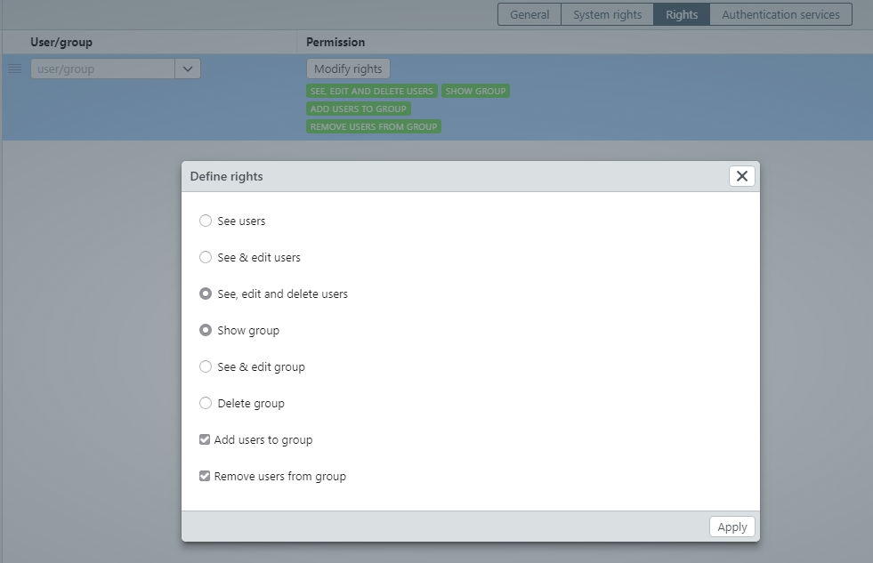

# Set up multitanancy based on the rights management

The [rights management](/webfrontend/rightsmanagement/rightsmanagement.html) in easydb can be used to separate administrative responsibilities for departments at pool level. Accordingly, an administrator is set up for each pool. In the following configuration example, different departments (pools) are set up with their own administrators and user groups. 

This use case consist of 3 user groups for each department:
* Department-Admins
* Department-Write
* Department-Read

Via the user group management, the groups are set up and the rights are assigned. The user group *Department-Admins* requires the following system rights:
* User management
* Pool management

Die Fachbereich-Admins benötigen darüber hinaus Rechte an den Gruppen *Fachbereich-Schreiben* und *Fachbereich-Lesen*. Hierfür muss im Benutzerguppenmanagemnet an diesen beiden Gruppen jeweils im Reiter *Berechtigungen* eine neue Zeile hinzugefügt und die Fachbereich-Admins ausgewählt werden.

The *Department-admins* also require rights for the groups *Department-Write* and *Department-Read*. For this purpose, a new line must be added to these two groups in the tab *Rights*, where the *Department-Admins* need to be added.

The following checkboxes must be set:

*Department-Admins* require the right "Create subpool" at pool level, to create additional pools within the department pool. For this purpose, the department pool is selected in pool management. A new line must be added to the rights tab and the *Department-Admins* group must be selected. The checkbox "Create subpools" must be activated via *Modify rights*.

By saving the settings, the set rights apply to the user groups and pools.