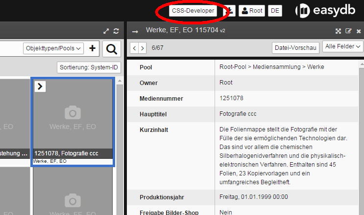
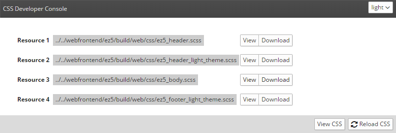
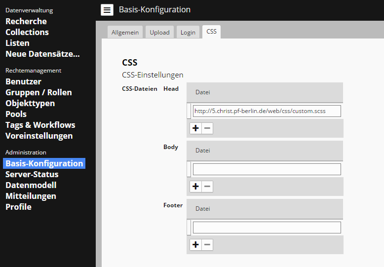

# Quick Start
The goal of this tutorial is to change the background color of the main menu.
This is achieved by the incorporation of user-defined SCSS or CSS code into the existing SCSS file structure of the EasyDB5.

## The CSS Developer Console
In order to keep the used CSS efficient and consistent, various SCSS files are compiled into a CSS file depending on the current configuration of the EasyDB.
To get an overview of the SCSS files, press the <code class="button">CSS-Developer</code> button, which will appear when the CSS plugin has been installed correctly.




The *CSS-Developer Console* opens in a separate window.




Here are the files that the EasyDB needs to create your CSS file.
All resource files belong to the head, body or footer categories.

| Resource file | Description |
| - | - |
|*1. ez5_header.scss* | Contains variables, mixins, and extenders divided into skin (colors, fonts) and structure (sizes, paddings, margins) |
| *2. ez5_header_light_theme.scss* | Overwrites the header SCSS file with Theme own values. 'Light' stands for the currently selected theme. At the top right of the <code class="button">CSS-Developer Console<code class="button"> is a drop-down menu with which the theme can be modified |
| *3. ez5_body.scss* | This file contains the actual CSS classes that use variables and mixins |
| *4. ez5_footer_light_theme.scss* | Similar to the header a theme own file which allows to overwrite all the defined ones |


| Button | Description |
| - | - |
| <code class="button">View</code> | displays the resource file in the browser. |
| <code class="button">Download</code> | allows to download the file for more detailed investigation
| <code class="button">View CSS</code> | shows the final CSS file generated from the resource files, or an error log if necessary. |
| `Reload CSS</code> | builds a new CSS file from the resource files and automatically loads them into the EasyDB frontend

## Integrate your own SCSS files
In the basic configuration in the CSS tab you can integrate your own SCSS or CSS files, which then overwrite the respective area.




In our example, the *custom.scss* file is embedded using a URL to overwrite the head of our SCSS files.

*custom.scss* Source code:
```Scss
$root_menu_background_color: darkslategray;
```

After entering the URL and the `Save</code>, the CSS is immediately compiled.
Make sure that the *CSS Developer Console* is open before you can fix any errors.

The main menu should now have changed its color.

