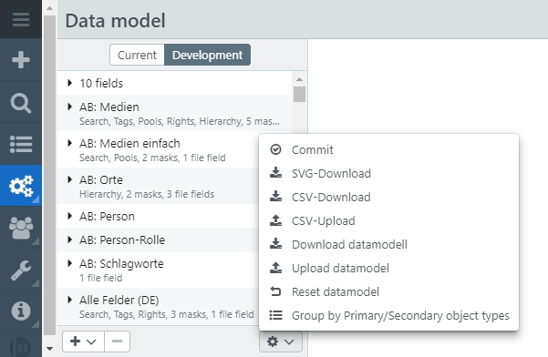
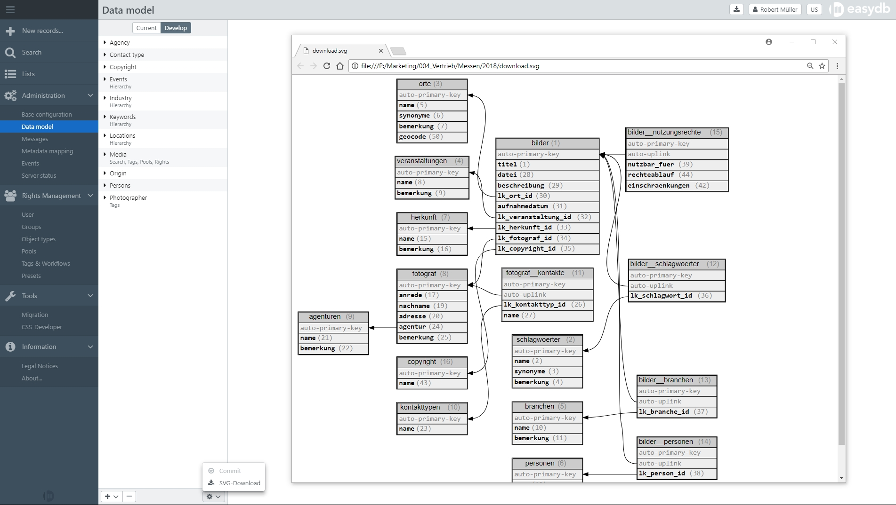

# Data model

In the data model, the current data model <code class="tab">Current</code> can be viewed, and with proper access rights the development version <code class="tab">Development</code> can be viewed as well. <code class="button">Activate Changes</code> to accept changes made in the development version. This will overwrite the current version.

> NOTE: Be aware that this process causes a lot of activity on the server side, A complete re-indexing of all records. Until full indexing, users may find records in the old format. In some cases, it may also happen that records affected by changes are not displayed to users until the re-indexing is complete.

## Definition of fields

Object types and masks are defined in the data model. Object types describe the structure of the data in the database. Masks describe the input and output views of the object types and therefore the data records. If, for example, 20 fields are defined for an object type, different field combinations can be viewable from masks. For instance, user 1 could have the right to mask 1, perhaps 5 of these fields. User 2 could be provided with mask 2, another 5 fields and with mask 3 they could view the other 15 fields.

* [Object Types](./objecttype/objecttype.html)

* [Masks](./mask/mask.html)

> NOTE: It is possible to hide individual fields for certain users or groups and to refine the view of an object type and its corresponding masks using the [field rights](../../rightsmanagement/objecttypes/objecttypes.html#fieldrights) for the object type.

## Export/Import data model 

easydb offers the possibility to download the data model of any easydb instance and to save or reuse it as a JSON-file. The export contains the configuration of all object types and associated masks.

It is also possible to import an externally saved data model into easydb.

The data model can be downloaded and uploaded via the data model in the main menu. It is available below the list of object types in the development environment via the <i class="fa fa-cog"></i>-menu. 

NOTE: Uploading data models is primarily intended for transferring existing data models to new instances. Note that uploading and activating a new data model overwrites an existing data model and does not supplement it.

## Reset data model

The menu within development environment provides the option to reset the data model in development mode. Changes within the data model in development mode are thus reset to the status of the current data model.

## Objectstore

The Objectstore works as a node, which allows to work on a data model from different instances. The current data model is stored in a virtual environment and synchronized with other instances before further changes can be made.

If the Objectstore is configured, a <i class="fa fa-lock"> </i>-button appears next to the <i class="fa fa-cog"> </i>-menu. If the is activated it appears <i class="fa fa-lunock"> </i> (open) and it is possible to work on the data model. It is not possible to work on the data model from other instances during this time. The icon remains locked there. Once the changes to the data model are complete and activated, the <i class="fa fa-lunock"> </i>-icon must be clicked again to complete the process. The current data model is then transferd to the Objectstore. If another editor from another instance activates starts editing the data model, a message appears that the data model must first be updated. Once synchronization with the data model from the Objectstore is complete, the data model can be edited.

## Graphic of individual data model

The options menu allows you to visualize the structure of the data model. The current data model can be downloaded as an svg graphic.

