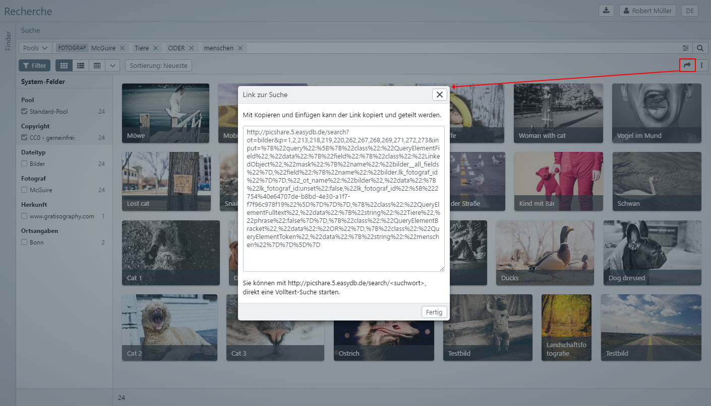
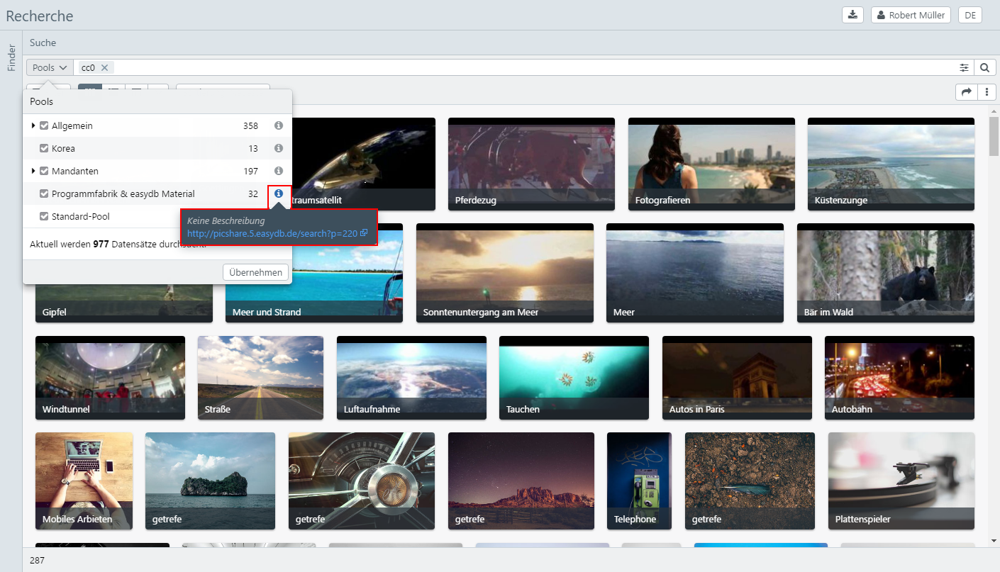
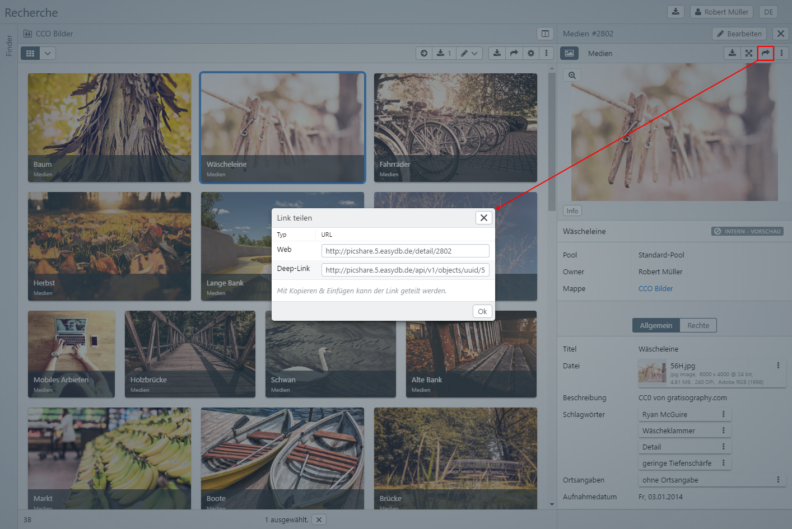

# Links / Deep links

Single and multiple records or files can be shared in easydb via Link/Deeplinks. Links/Deeplinks are available in easydb in several places.

## Search

In easydb you can perform a **search** via a simple search or the expert search and share the results of this search through a link. No special permissions can be configured for this link.

> Note: http://picshare.5.easydb.de/search/ <search> can also be started directly with a full-text search.

**Saved Search** can be shared and shared with users and groups from the Finder. The share is configured via the context menu in the Finder. In the <code class="tab">Share</code> tab, you can create users and predefined or custom privileges (<i class =" fa fa-bars "> </i> options). The name of the folder can be changed in the <code class="tab">General</code> tab and a description of the folder can be adapted.

> NOTE: Note that you must save the settings before you can share the link.

Pool

A link to the pool and thus to all the records that are located in this pool can be called up and copied via the <i class = "fa fa-info-circle"> </i> button in the pool selection. No special permissions can be configured for this link.

## Detail / Editor

The <i class = "fa fa-share"> </i> (share-button) in the detail view can be used to create a link to the **record**. The weblink leads to the record in easydb. The deep link, if configured, leads to the output of the data record in XML format. The link displays the most recent version of the record. Older versions can also be accessed via this link when indicated with **version/< number >**. Further options for [Deep Links](https://docs.easydb.de/en/technical/api/objects/objects.html) are listed in the technical part. No special permissions can be configured for this type of link. 

The link to **file** can be sent via the <i class = "fa fa-ellipsis-v"> </i> options menu. This option is available from the detailed view and the editor. The links are generated according to the preconfigured versions and formats. No special permissions can be configured for this link.

> NOTE: These links can be generated from the detailed view and the editor.

The links are shared with the Deep-Link user. If some URLs appear to be unavailable, this is because they are not shared. Please refer to [Basis Configuration](../../../administration/base-config/base-config.md) and the right-hand management under [System Rights](../../../rightsmanagement/rightsmanagement.md) for instructions on setting up deep links.

## Mappings

Folders can be shared and shared via the context menu in the Finder or the <i class = "fa fa-share"> </i> over the detail view for the user / group binder. In the <code class="tab">Share</code> tab, you can create users and predefined or custom privileges (<i class =" fa fa-bars "> </i> options). The name of the folder and the description of the folder can be adapted in the <code class="tab">General</code> tab. The uploading of assets into this folder can be activated in the <code class="tab">Upload</code> tab.

> NOTE: A shared or shared folder is indicated by this icon on ​​the folder.

## Lists

A link to the record can be created from the lists. If the data set of an object type is opened in the detail view, a link to the **data set** can be created via the <i class = "fa fa-share"> </i> button. The weblink leads to the record in easydb. No special permissions can be configured for this link.

