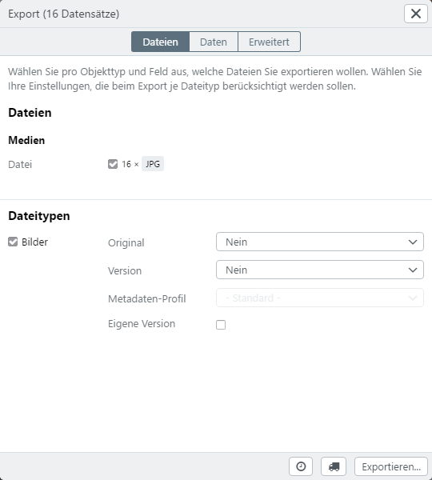

# <a name="main dialog"></a>Export

Basically, you can export all the data you can search from easydb.

Exports are first created in easydb and then executed. After execution, the data is provided for downloading or copied to another server via a transport path (optionally, for example, RSYNC, FTP). The exports are performed asynchronously on the easydb server, since these processes are Much time.

> NOTE: Exports can be scheduled with schedules (*see below*) and then periodically executed by easydb. Thus, for example, Make regular backups of your easydb or perform scheduled data expansions.

Within an export process, you can calculate files of different sizes, export sections from images, and specify a format for export.

Exports can be created via various ways from the easydb:

* Single data record (right-click in the search result)
* Select (right click on a selected data record)
* Map (right click on the map)
* Search (right-click in the search result)


In the upper part of the dialog you can define which files are exported. In the lower part, you specify which data are exported. Records are exported with data as CSV or XML separately from the actual files. If desired, you can also export links to the files in the data.

After the settings, click <code class="button">Export ...</code> to create and start the export.

Before the export starts, a message dialog appears in which a name can be entered. For exports with schedules, you must assign a name. For exports without schedules, the name is optional.


Then click on <code class="button">Save</code> to start the export final.

## Files



Here, you select which files you want to export for each object type and field. The name of the file type is displayed after the field name. These numbers only include the preferred versions of the files.

## Data Types

Here you decide for each datatype whether the files of this type are considered for the export or not. In addition, the file type can be used to determine which version of the file is to be exported and whether or not there is a size or format adjustment during the export.

The following settings can be made:

### General Settings

| Setting | | Declaration |
| - | - | - |
| Original | No | No original file is exported. |
| | Original | Only the *original* will be exported. |
| | Actual Original |This is the preferred visible version of the file. For example, if you rotated or cropped an image, this version is called *Current Version*, the unaltered image is called *Original*. For files that have not been rotated or otherwise modified in the easydb, *Current Version* and *Original* are the same |
| | Original + Current version | It will be *Original* and *Current original* |
| Variant | No | No further variant of the file to be exported is calculated for the export. |
| | Pre-calculated variant | Here you see a list of pre-calculated variants. Which variants appear here is part of the [System Administration Configuration](../../../../sysadmin/konfiguration/konfiguration.html). Depending on the data type, these variants are different. You can select from the list, which variant / size should be exported in addition to the original and / or the current original |
| Metadata profile | | The profile used for XML / EXIF ​​/ IPTC writing. Available for the file types *Image*, *Audio*, *Video* |
|Your own variant | | For some file types, this setting is available. Depending on the type of file, you can customize the export format |
| | Watermark | If set, a watermark is added to the file (only for images). The watermark is set at [Pool](../../../rightsmanagement/pools/pools.html). Only pictures in a pool can be provided with a watermark. Only available for file type *Image* |
| | -&nbsp;Unchanged&nbsp;-| The file gets the metadata of the *original* version |
| | -&nbsp;Default&nbsp;-| The profile of the *pool* or *object type* settings is used here |
| | -&nbsp;Remove&nbsp;- | The file is exported without metadata. |
| | *&lt;Profile&gt;* | Specify a *profile* used for export |

### Format options for images

| Setting | | Declaration |
| - | - | - |
| Format | Unchanged | The format of the selected *version* is retained. |
| | JPEG | JPEG format with indication of quality *Low*, *Medium*, *High*, *Maximum*
| | TIFF | TIFF |
| | PNG | PNG |
| | BMP | BMP |
| Color Space | RGB | RGB color space |
| | CMYK | CMYK |
| | Grayscale | Grayscale |
|  Size | *Default sizes* | The list of preset sizes is displayed. |
|  | Own ... | Select this setting to set your own size |
|Measure|long side|The dimension is long, for example, 400 pixels and a 800 x 600 large image, the image will be 400 x 300 pixels|
| |short side |The pixel specification refers to the short page. For example, 400 pixels and a 800 x 600 large image, the image will be 600 x 400 pixels |
| | Width | The pixel value refers to the width of the generated image. |
| | Height | The pixel value refers to the height of the generated image. |
| Pixels | | Number of pixels for the dimension specification. Note that DPI can not specify DPI for the calculation of dimensions / measures during export. In order to calculate DPI, the target print format must be known. This will then inevitably be converted into pixels again |

### Format options for videos

*No format changes are supported for videos. You can access the pre-produced formats and format conversion using an external program.*

### Format options for audio

*No format changes are supported for audios. You can access the pre-produced formats and format conversion using an external program.*

### Format options for Office & PDF

| Setting | | Declaration |
| - | - | - |
| Format | PDF | Select this setting to create a PDF from Office documents such as Word, Excel, etc.


### Format options for other file types

*No format changes are supported for other datatype.*


## Data


| Setting | | Declaration |
| - | - | - |
| Create CSV file | | Creates a CSV with all data. |
| Create JSON file | | Exports the data as JSON (to a file). |
| One JASON file per record || Exports JSON to one file per record. |
| Create XML file | | Export the data as XML (to a file)
| One XML file per record || Exports XML to one file per record. |
| XML profile | -&nbsp;Standard&nbsp;- | easydb Standard XML Format |
| | -&nbsp;Standard (flat)&nbsp;- | easydb Standard XML Format |
| | *&lt;Profil&gt;*| Uses the specified profile to create the XML. |
| Select your own fields || If you can set your own fields (see **field selection**) |


### <a name="field selection"></a>Field Selection

Normally, all fields are available that are available in the form and are also used in the search for the display (detail view). If you do not want this, or if you want to give the fields their own name, use the field selection dialog.

> Fields are exported with your database name, not with the visible field identifier from the form.


Select the checkbox for the fields that you want to use in the export. Change the identifier for your export.

The order of the fields can not be changed. The order used by the mask is used.

#### Linked Object Types

Linked object types can basically be exported to a level, i. A link from the first linked record is not tracked.


#### Multiple Fields

Multiple fields are exported in standard format. Select the check box next to the multi-field name. If you need to export individual fields, use the checkboxes below the multiple field.


#### Data Fields

For files, a link can be exported in the data. A link will be displayed for each exported version (*Original* and *Current version*). You can set what these links show.


| Setting | | Declaration |
| - | - | - |
| URL | - No - | Is the default. No link is exported. |
| | Original | Here you can select the link for the original, the current original or for both versions
| | Small | *Yes* to export the link to a small version. |
| | Preview | *Select Yes* to export the link to a preview version
| | Large | *Yes* to export the link to a large version. |

## Advanced


| Setting | | Declaration |
| - | - | - |
| Package Size | 100 (default) | Creates export packages with 100 records each
|| Unlimited (all in one folder) | All records of this export are packed into a folder |
|| Own value  |Enter your own number for the size per package |
| Filename | Default Template | The current name from the default template is used
|| Original filenames | The name of the original file is used. |
|| File name|  A separate file name can be entered. For this, substitutions can be used, which are also available for the respective object types (see [*File names for export and download*](../../../rightsmanagement/objecttypes/objecttypes.html) |
||Substitutions|```%medien_ab.text2%```<BR>```%medien_ab.text1%```<BR>```%medien_ab.text4%```<BR>```%medien_ab.text5%```<BR>```%medien_ab.boolean%```<BR>```%medien_ab.datum1%```<BR>```%medien_ab.datum3%```<BR>```%medien_ab.datum2%```<BR>```%medien_ab.zahl1%```<BR>```%medien_ab.zahl2%```<BR>```%medien_ab.lk_systematik_id._standard.1.text%```<BR>```%medien_ab.ort._standard.1.text%```<BR>```%medien_ab.fotograf._standard.1.text%```<BR>```%medien_ab.url%```<BR>```%medien_ab.link%```<BR>```%medien_ab.text3%```<BR>```%medien_ab.medium%```<BR>```%medien_ab.medium2%```<BR>```%medien_ab.email%```<BR>```%medien_ab.nurregexp%```<BR>```%medien_ab.regexpundhinweis%```<BR>```%_export.name%```<BR>```%_system.easydb.name%```<BR>```%_global_object_id%```<BR>```%_system_object_id%```<BR>```%_asset.original_filename%```<BR>```%_asset.version%```<BR>```%_asset.class%```<BR>```%_asset.extension%```<BR>```%_asset.technical_metadata.width%```<BR>```%_asset.technical_metadata.height%```<BR>```%_asset.technical_metadata.max_dimension%```|
|Scope|Checkbox|With the setting of the checkbox, only new and changed data sets are taken into account for the export.|


# List of Exports {#exportmanager}

Exports from the export module can be called up in the upper right via the **export manager**  <i class="fa fa-download"></i> and the *export list* can be displayed.


The status of a running export is indicated by a small badge in the export manager.

|Symbol|Description|
|--|--|
||There is no active operation in the export list.|
||Exports are waiting to start or are currently running.|
||Exports are finished.|
||Exports have been terminated due to errors.|

The export list shows all exports and failed downloads. If you press the <code class="button">ALT</code> key while opening the export manager, the successful downloads are also included in the list.

Detailed information on the export history can be viewed via the Export Manager

[Further information to exporting](exportmanager_en.jpg)

|Selection|Detail|Explanation|
|--|--|--|
|Export||Displays the name of the export or download. When you create an export, you can assign your own name. Exports without names or downloads are displayed consecutively numbered. Further information can be called up via the pull-down menu.|
||Event protocol| A log entry is stored for each event related to the export. The entries can be viewed here.|
||Transports| If there are configured transports for an export, they are displayed here. Under the respective transport, an event log is available, as well as a list of the packaged and sent files.The files are removed when exports have expired. These can be updated by restarting the export. |
||Files|Displays the files or directories for an export (if included) or a download. The files are removed when exports have expired. Next to each file and directory, there are ways to load and view the file.|
||<i class="fa fa-download"></i>|Download the file to the desktop.|
||<i class="fa fa-arrows-alt"></i>|View the file in the browser. If the browser can not display the format itself, the file is loaded. This feature is not available for files larger than 10MB.|
||<i class="fa fa-file-archive-o"></i>|Download the file or directory as ZIP.|
|Timestamp||Time of creation for new exports or last run after updates.|
|Typ|Export|Regular export.|
||Export (incremental)|Export for which "Export new or modified records only" has been activated. |
||Download|Download of files. Successfully performed downloads will only appear in the list if the Download Manager button is used together with the ALT key. |
|Status|New|New export. Appears, for example, for new exports with a schedule that will run for the first time at a defined time. |
|| Done | Export was successful. It may appear with a warning. The warning details can be viewed in the event log. |
|| Processing |Export is currently in progress. |
|| Updated| Export has been modified or restarted. The timestamp shows the new run. |
|| Error |The export failed. Details can be found in the event log.|
|| Expired | The export is no longer valid. To make it available again, it needs to be restarted. By default, exports expire after 3 days. The expiry time can be adjusted by the easydb administrator via the [Server-Config](https://docs.easydb.de/en/sysadmin/konfiguration/yaml/yaml.html)|


Various functions are available for each export.

|Function|Description|
|--|--|
|<i class="fa fa-download"></i>|Loads the export as a zip file to the local computer.|
|<i class="fa fa-search"></i>|The export is transferred to the search bar and the search is started. This allows you to display the records that are currently being found for the export.|
|<i class="fa fa-edit"></i>|To adjust the Export settings (format, data, etc) open the [Export Dialog](#field selection).|
|<i class="fa fa-clock-o"></i>|To adjust the Time plan, open the [Time plan Dialog](#schedule).|
|<i class="fa fa-truck"></i>|To adjust the Transport, open the [Transport Dialog](#transport).|
|<i class="fa fa-play"></i>|Click here, to manually start an export.|
|<i class="fa fa-stop"></i>|Click here, to stop a running export.|
|<i class="fa fa-trash-o"></i>|Click here, to delete an export.|


## <a name="schedule"></a>Schedule

Time schedules ensure that the defined export is carried out regularly. For example, you can define a search, which then regularly causes an export once a week. To do this, click on <i class = "fa fa-clock-o"> </i> to view the schedule.

Schedules also work the same as scheduling [user](../../../rightsmanagement/users/users.html#schedule). You can choose from the presets a schedule for the schedule or define your own schedule. In the example, the export is executed every 12th of the month, when it is a Monday at 3pm.

> NOTE: If no exact times are set for the schedule, the export takes place at a certain point in time. This is then specified by the system and can differ per configuration.


| Setting | Description |
|--|--|
|<i class="fa fa-download"></i>|Download the file to the desktop.|
|<i class="fa fa-arrows-alt"></i>|View the file in the browser. If the browser can not display the format itself, the file is loaded. This feature is not available for files larger than 10MB.|
|<i class="fa fa-file-archive-o"></i>|Download the file or directory as ZIP.|

> NOTE: Exports are based internally on searches, that is, If you use time schedules, the exported records may differ after each execution, since a current search is carried out before the respective export process.


## Transport {#transport}

Exports require a transport so that the exported files can be externally accessed. Without transport, you can only access the exported files using the Detailed List in * Export List *. For example, a transport can provide a download or copy files to remote servers via RSYNC or FTP.

Click on <i class = "fa fa-truck"> </i> to access the transport dialog.


| Setting || Explanation |
| - | - | - |
| Type | Download | This transport provides files for external download. Upon request, an e-mail is sent to configured recipients after export
| | FTP | Transport to a server via FTP. |
| |Wordpress|Transport sends files to Wordpress. A timetable can be created for regular transports. |
| | Falcon.io | Transport sends files to Falcon.io. A timetable can be created for regular transports. |
| Options || For RSYNC and FTP server, optionally a directory, login and password can be configured
| Compression | zip - unlimitert | The files are packed into a ZIP
|| zip - 2GB | The files are packed in a maximum of 2 GB ZIP. If necessary. Several ZIP archives are created. If a single file is larger than 2GB, the ZIP for this file will also be larger
| Zip - 10MB | How *zip - 2GB* but with the size of 10 MB per file. |
|| tar.bz2 | The files are packed into a *TAR* archive that has been compressed with *BZ2*
|The recipient of the e-mail. |Use <i class = "fa fa-plus"> </i> and <i class = "fa fa-minus"> </i> to customize the list. |You can create e-mail users in addition to *Users* and *Groups*. How to do this is under [folders / share](../../search/collections/collections.html#sharecollection). |
|| message | In addition to the easydb standard text, you can also write your own text in an e-mail to the recipients

