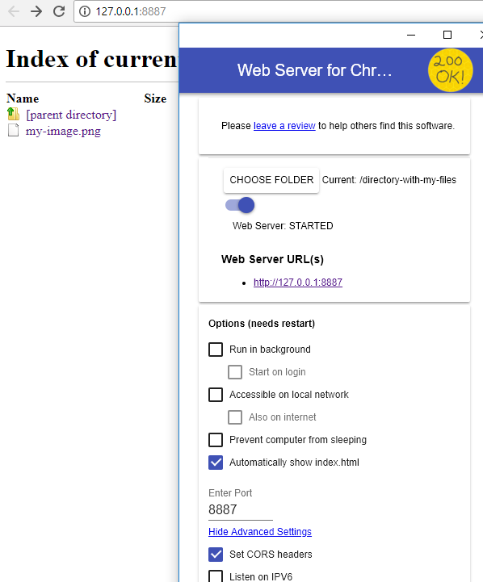

# Import files

Web browsers do not support direct access to files on your computer, which is why files for the [CSV Importer](../csvimport/csvimport.html) and the [JSON Importer](../jsonimport/jsonimport.html) must always be provided via a web server.

One way to work around this restriction is to use an extension for the Google Chrome browser. This allows you to set up a web server on your computer and access your files with just a few clicks.

The CSV and JSON importer get access to your network drives and local hard disks via the web server.

### Configuration

- File upload type: Method that will be used to upload files
    - Direct: The file will be downloaded and then uploaded by using [/eas/put](/sysadmin/eas/api/put/put.html).
    - URL (remote PUT): The file is not downloaded, and [/eas/put](/sysadmin/eas/api/rput/rput.html) is invoked directly using the file url. Therefore the server will download and upload the file. (this option should be the fastest)
    - FYLR. Proxy: This option is almost the same as 'Direct'. The difference is that the URL will use the FYLR. Proxy configured in base config. This option is disabled if there is no FYLR. configuration in base config.
    - Ignore: All files will be ignored.

### Import local files

#### Using Chrome

To import files that are in the local file system it is necessary to serve them in a local server. It's easy and fast to achieve by using a known Google Chrome extension called ['Web Server for Chrome'](https://chrome.google.com/webstore/detail/web-server-for-chrome/ofhbbkphhbklhfoeikjpcbhemlocgigb). It is necessary to choose the type 'Direct' in this case.

1. Install the extension and open it. ['Download here'](https://chrome.google.com/webstore/detail/web-server-for-chrome/ofhbbkphhbklhfoeikjpcbhemlocgigb)
2. Click "Choose folder" and then choose the folder where the desired local files to import are located.
3. Open advances settings and enable the option called 'Set CORS headers'.
4. Restart the browser and open the extension again.
5. Enter to **http://127.0.0.1:8887** and all the images will be there. (by default the port is 8887, but it can be changed)

