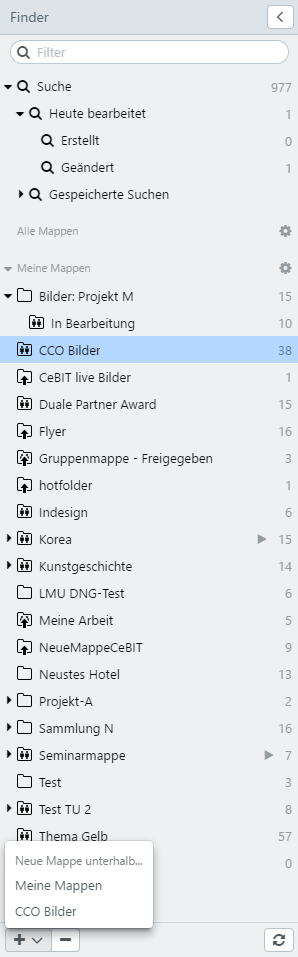

# Quick access 

The quick access provides options to manage compilations of records. These are, on the one hand, dynamic folders, such as saved searches and ad hoc folders for records processed on a daily basis. And on the other hand, manual compilations, including own and shared collections. With <code class="button"> < </code> the quick access can be switched on and off.

* [Saved search](search/search.html)
* [Category browser](category/category.html)
* [Collections](collection/collection.html)

## Overview in quick access

easydb provides the following options in the quick access:

|Collection|Subordinate|Description|
|--|--|--|
|<i class="fa fa-search"></i> Search||Corresponds to the current number of records available to you in easydb. From a map you can go directly back to the main search via this route.|
||<i class="fa fa-search"></i> Today edited | Contains the records you edited today. The current day date is used for this purpose, therefore 0:00 to 23:59 of the current day. For more complex searches that go back in time, a query of the [change history](../../features/datatypes/datatypes.html#changelog-search) can be carried out in the [expert search](../search.html#expert).|
||<i class="fa fa-search"></i> Created |The records that you created today.|
||<i class="fa fa-search"></i> Edited| Records that were edited by you today.|
|<i class="fa fa-search"></i> Saved Search||The results of a search can be stored in the <i class = "fa fa-floppy-o"> </i> menu and can be accessed again at this point. This folder is dynamic. All the records matching the saved search criteria are displayed.|
| My Collections || User-created sets of records. |
| Shared Collections || Compilation of records shared by other users. The authorizations are applied to the folder that the creator has assigned

## Search in quick access

You can search for folders using the search field. The matching of the input in the search field with a matching folder is highlighted in color. Folders that do not match the input are hidden.

easydb bietet im Schnellzugriff folgende Speicheroptionen an:

|Colleciton|Subordinate|Description|
|--|--|--|
|<i class="fa fa-search"></i> Search||Corresponds to the current number of data records available in easydb. You can click here if you want to return to the main search from a collection. The number on the right shows the number of available records. |
||<i class="fa fa-search"></i> Worked an today|Contains the records you have been working on today. The current day is determined from 0:00 to 23:59. For previous changes on records use the [Change history](../../features/datatypes/datatypes.html#changelog-search) in the [Expert search](../../search/search.html#expert). The number on the right shows the ammount of records you have worked on today.|
||<i class="fa fa-search"></i> Created |The records that you created today. The number on the right shows the amount of records you have created today.|
||<i class="fa fa-search"></i>Changed|The records that edited today. The number on the right shows the amount of records you have changed today.|
|<i class="fa fa-search"></i> Saved search||The matching hits of your search can be saved by using the otion menu <i class="fa fa-floppy-o"></i>. After saving it with a name, it is stored here and can be reused. Here all records are shown that match the criteria set for the saved search. This number is dynamic. |
|<i class="fa fa-file-o"></i> Kategoriebrowser||Wenn aktiviert, erscheinen hier Listen von Nebenobjekttypen, über die ein schneller Zugriff auf verknüpfte Datensätze möglich ist. Der Kategoriebrowser ist eine Filtermethode, die als Schnellzugriffsvariante dient und entsprechend der Eingabe über die Expertensuche agiert. Die Zahl rechts neben der Kategorie zeigt die Summe der Einträge, die zur Kategorie gehören. Die Zahl rechts neben den einzelnen Kategorieeinträgen zeigt, die Anzahl der verknüpten Datensätze an. Die Zahl rechts zeigt die Anzahl verknüpften Datensätze in dieser Mappe an. |
|Meine Mappen|| Vom Benutzer angelegte Zusammenstellungen von Datensätzen. Die Zahl rechts neben der Mappe zeigt die Anzahl der Datensätze, die in dieser Mappe verknüpft sind, an. |
|Freigegebene Mappen|| Zusammenstellungen von Datensätzen, die von anderen Benutzern freigegeben wurden. Es gelten die Berechtigungen an der Mappe, die der Ersteller zugewiesen hat. Die Zahl rechts zeigt die Anzahl verknüpften Datensätze in dieser Mappe an.|

## Suchen im Schnellzugriff

Über das Suchfeld kann der Schnellzugriff durchsucht und auf entsprechende Treffer eingegrenzt werden. Durchsucht werden die Bezeichnungen der gespeicherten Suchen, der Einträge aus dem Kategoriebrowser sowie der Mappen (nicht aber die damit verknüpften Datensätze). Angezeigt werden dann nur übereinstimmenden Einträge. Nicht passende Einträge werden aus dem Schnellzugriff ausgeblendet. 

