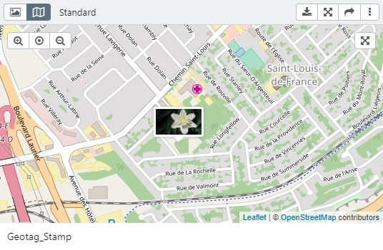

# Detailed view

The detail view for a data record appears either on the right side of the sidebar or on the full screen.

## Sidebar

In the sidebar, the [File Viewer](../../features/datatypes/datatypes.html#tools) appears in the upper area, which you can turn on and off with <i class="fa fa-image"></i>. This state is stored in your user profile.

|Button|Description|
|--|--|
|<i class="fa fa-arrows-alt"></i>|Open the details in fullscreen.|
|<i class="fa fa-pencil"></i> <code class="button">Edit</code> |Opens the editor in the sidebar.|
|<i class="fa fa-times"></i>|Close the Sidebar.|
|<i class="fa fa-download"></i>|Open a selection menu regarding file size in the Export manager (see below).|
|<i class="fa fa-image"></i>|Turns the preview on and off  |
| <code class="button">Media</code> | If several masks are available for the data record, this is displayed as a selection field. Authorized users can change the mask via this field. If only one mask is available, this is displayed as a non-active field  |
| | Appears with hierarchical object types and displays the hierarchy space as well as the detail view. |

### Download

Select a download size (variant) for the file field you want to download. Select an option to export the metadata profile and the file name. You can also enter your own filename. You can use the substitutions that are also available for the object types under [*File names for export and download*](../../../rightsmanagement/objecttypes/objecttypes.html).

The download is a ZIP file. easydb supports the download of different file sizes (variant). [Custome variants](./sysadmin/konfiguration/produce/produce.html) can be configured by a system administrator using a .yml file.

## Full screen

You can scroll through lists in full screen. At the bottom there is an overview with previews. At the top left, you can use <code class="button">Detail</code> to display more information about the record. With <i class =" fa fa-expand "> </i> you can enlarge the full screen to the whole screen and with <i class="fa fa-times"> </i> you close the full-screen view. In the upper left corner <i class="fa fa-search-plus"> </i>, the zommer is activated to show details enlarged.

With <i class="fa fa-chevron-left"> </i> and <i class = "fa fa-chevron-right" aria-hidden = "true"> </i> next to the displayed record can move to the next Record. The preview bar can be moved to the left and right using the appropriate icons at the edge. Records containing other assets are grouped by a border, as shown in the screenshot.

> NOTE: If the full-screen icon is gray (= disabled) in the full-screen view in the asset browser as well as in the asset detail, the user has not activated full-screen mode on his browser.

## Share

From the top of the Data View, you can share <i class="fa fa-share"></i> the record or the file that is associated with the record from the corresponding field. For more information on sharing and releasing via links, see the [DeepLinks](../../features/deeplinks/deeplinks.html) section.

## Hirachical object type Objekttypen

## Thumpnails dispalyed in map {#geotag}

The detail view offers an option to display files in maps, if they contain geocoordinates in the metadata. Next to the button for showing and hiding the file preview is a button with a map. These buttons can be used to switch between the views. The preview of the file is shown by a small thumbnail on the included [OpenStreetMap](http://www.openstreetmap.org).  

The geodata must be included in the file. The representation in maps does not apply if the geodata is only written into the metadata of the data set. 

The display of geotags in maps is a plugin for easydb, which is delivered as standard (incl. YML-config). It can be activated via a checkbox in the [Basic Configuration](/webfrontend/administration/base-config/base-config.html#design) in the tab "Design". It is also possible to individualize the display in maps for each object type by changing the settings in the masks.