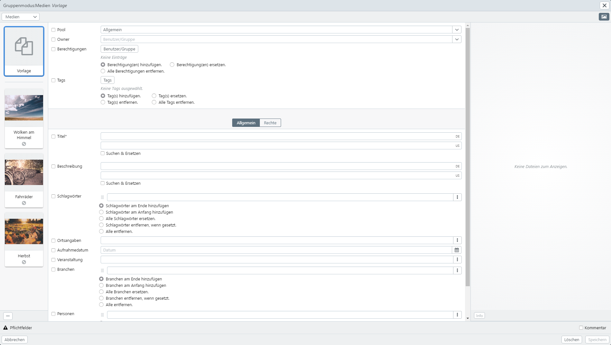

# Input

The input, modification, recreation etc. of records is done in easydb in the *Editor**. The size of the editor can be different, depending on where the editor is started from. The editors works in the same way, except for some functions that are intended for the respective type of editing.

|Editor|Call|File Preview|History|
|--|--|--|--|
|New editor| By clicking on [New records](/webfrontend/datamanagement/new_objects/new_objects.html) in the main menu or by drag & drop of files from a local server.|X|-|
|Sidebar|Click on a record from the search result or from the folder preview. |X|-|
|Fullscreen|When using the context menu from the search result and *Lists* in the admin area. |X|X|
|Group Editor|Context menu after selecting multiple records in the search result. |-|-|
|Popover|Little editor accessible from expert search and other editors when searching linked records. |-|-|

The file preview in the editor can be activated and deactivated via <i class="fa fa-picture-o" aria-hidden="true"></i>. It presents all files of a data set (if specified in the mask) in a preview browser. It provides [Zoomer](../../features/datatypes/datatypes.html#tools) and [Office-Viewer](../../features/datatypes/datatypes.html#tools) .

> NOTE: Depending on the data type, there are different types of input fields. More information about this can be found [here](../../features/datatypes/datatypes.html).

Functions in the editor

|Button|Explanation|
|--|--|
|<code class="button">Save</code>|Save the records (New) or updates the records (Group Editor). |
|Mandatory Fields | must be filled in to save. If a mandatory field consists of several fields for multilingualism, it is sufficient to fill in one language (=field). |
|Comment (Checkbox)|If set, a comment is requested before saving, which is then displayed in the history. If provided in the mask, the comment can be obligatory and you cannot uncheck the checkbox. |
|<code class="button">Copy</code>|Open an unsaved copy of the current record for editing as a new record. |
|<code class="button">Delete</code>|Deletes the current record. Note that deleted data records cannot be found in the current easydb version. easydb stores all old versions of the deleted record. |
|<code class="button"> < </code> & <code class="button"> > </code>|Browse to the previous or next hit. When you make a new entry, this jumps back or forth in the left bar. |
|<code class="button">File Preview</code>|Turns the file preview on or off. |
|<code class="button">Change History</code>|Hide the modification history (see below). |
|<code class="button">Mask</code>|Turns the mask, you may have to save it first to avoid losing your data. |
|<i class="fa fa-thumb-tack"> </i>|Use and create templates. If you have saved templates, this menu provides a list of youre templates.   *Save as template... *: A template is created based on this data record. A dialog opens in which a name for the template is assigned.   *Customize*: Change the name of existing templates or delete templates. |

> NOTE: Templates can only be saved per user and per object type and/or mask. If a template is supposed to be available to several users, templates must be defined at pool level. Via pool users have access to general templates and can add them to their own template list.

##  Change History

In the change history, you can display earlier versions of the data record. The system displays who changed the data record and when and the comment, if one has been created.

# Group Editor {#groupedit}

In the group editor, you can update up to 1000 data records for an object type at the same time. You can select one or more fields for this purpose. The update per data record is then limited to the specified fields, other fields remain unaffected by the action.

The group editor is available in the context menu, when more than one record is selected. If the selection contains different object types, the context menu provides the option to select the object type.

Editing fields in the group editor works similar to all other editors. In addition to the general functions of the editor, the group editor also offers some special functions:

|Function|Explanation|
|--|--|
|Template|Is the first element on the left in the selection display. You can use the template to edit all records that are listed below the template.|
|Ckeckbox|In front of each field there is a checkbox that has to be activated to change it for all records when saving. Each field has different options for adding, replacing or removing entries.  |
|<code class="button"> < </code> & <code class="button"> > </code>|The pagination appears when more than 50 records have been selected for group editing.|
|<i class="fa fa-minus"> </i>| Removes the selected record from the group editor. Only one record at a time can be removed from the group editor. Selecting multiple records is not supported in this mode.|
|<i class="fa fa-clipboard"> </i>|Copies the entries of the selected record to the template.|
|<i class="fa fa-thumb-tack"> </i>|Saves the template. Saved templates are then available in the group editor at this point in the selection menu for new operations. Templates can only be saved per user and mask. See also [Editor functions](/webfrontend/datamanagement/search/editor/editor.html#editor) |

## Rights Lists

|Settings|Explanation|
|--|--|
|Add permissions|Add permissions adds the newly entered permissions rows per record. |
|Replace permissions|Replaces the specified permission rows per record. Only the user or group is compared. If the who attribute is empty, its rights will be appended to all existing ACL entries
|Remove permissions|Removes the specified permissions rows per record. Only the user or group is compared. If the who attribute is empty, its rights will be appended to all existing ACL entries
|Remove all permissions|Removes all rights lines on each record. |

## Tags

|Setting|Explanation|
|--|--|
|Set tag(s) will be set for each record. |
|Replace tag(s)|The specified tags replace the existing tags for each record. |
|Remove tag(s)|Remove the specified tags. |
|Remove all Tags|All tags in each record will be removed. |

## Multiple Fields

|Setting|Explanation|
|--|--|
|Add to End|Add multiple field rows at the end of each record. |
|Add at the beginning|Add multiple field rows at the beginning of each record. |
|Replace all|Add the multiple field rows to each record, delete all existing records first. |
|Remove when set|Removes multiple fields from the record if the set fields are identical. |
|Remove All|Remove all multiple fields on the record.|

## Boolean (Yes/No-Fields)

Booleans with Yes/No option are set by a checkbox. You can use masks to define how entries of this field type are displayed in the detail view. See the settings in [Options](../../../administration/datamodel/mask/mask.md#definition) for Yes/No fields.

