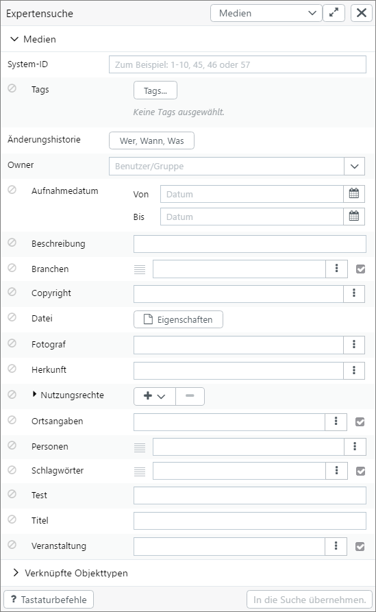
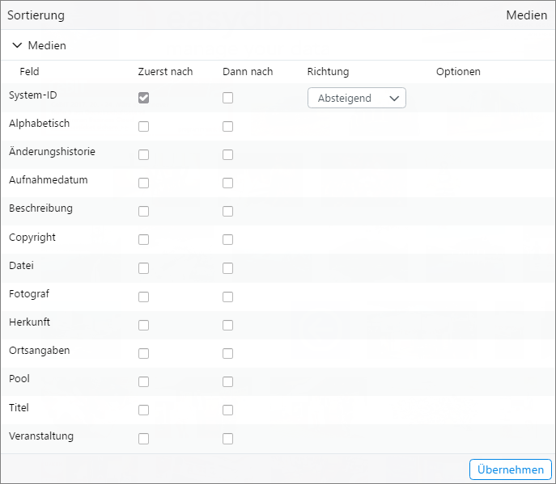
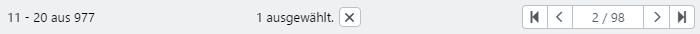

# Search

You can access the main search via the menu item Research. This is also by default the view after the user login.

## Automatic completion

When you start typing your search into the search field, suggestions are generated based on the entered word or words. Easydb searches for suitable words and also for suitable linked records.

You can select a found *token* or a linked record (cursor up/down + return or mouse). The selected entry then creates a search term in the search field. Multiple search terms can be added and combined with commands (search operators).

## And/or links

In order to create a combination of search terms, Boolean logic allows the following entries to be entered via key combinations:

|Taste|Such-Operator|Erläuterung|
|--|--|--|
|<code class="button">-</code>|<code class="token">NOT</code>|The following search term is linked to "NOT"|
|<code class="button">+</code>|<code class="token">AND</code>|The following search term is linked to "AND"|
|<code class="button">,</code>|<code class="token">OR</code>|The following search term is linked to "OR"|
|<code class="button">(</code>|<code class="token">(</code> |Bracket for logical connections.|
|<code class="button">)</code>|<code class="token">)</code>|Bracket for logical connections.|

> Use the keyboard to scroll through the search terms with the cursor on the left and the cursor on the right. Use <code class="button">Backspace</code> or <code class="button">Delete</code> to delete a search term. You can not change search terms, you can only delete them and re-enter them again.

##  Object Types/Pools

The search runs by default across all pools and object types that contain records that you can read at least. Click on <code class="button">Object Types/Pools</code> to customize this search filter.

Use the checkboxes to select or deselect individual object types or pools. Press and hold <code class="button">Alt</code> to switch all checkboxes on one level at a time.

Click on the <i class = "fa fa-info"> </i> to get information about the object type or pool. A contact person and a description are displayed here.

##  Expert Search

To define more complex filters for the search, click <i class = "fa fa-sliders"> </i> to the right of the search box. By entering terms into the search fields, you can define the search for one or more fields. The entries are taken as search terms in the search field.

You can access other object types by using the <code class="button">All object types</code> pull-down list . Then the search term is limited to an object type. If you want to search more than one object type, you must call up several expert searches and enter individual search terms into the search field.

The checkbox in the right column searches *records without entry*, that is, For example, if you select this checkbox for a field with Name *Description*, and then click on <code class="button">Include in the search</code>, filter all records where the *description* field is empty.

In *All object types* shows the secondary search in the upper part under *linked object types* common linked object types and possibly the type *file* which can be searched together.

In *Common fields* the fields are displayed, which occur conceptually in all object types. Note that here the translated name is used for comparison, not the database field name.

Within individual object types, it will be displayed in *Common fields* if the field appears in more than one form.

> NOTE: The sorting in the expert search is alphabetic since it can refer to several masks. For this reason, it is not possible to display the order of the fields as in a form.

## Sorting

The search result can be sorted according to one criterion or two search criteria.

Depending on the selected object types/pool selection, various fields are available here. Fields are grouped according to their localized name.

In some fields, the sorting attribute can be selected in addition to the sorting direction, e.g. For files where *file size*, *file class* and *format* can be sorted.

For some data types, a grouping is also active during a sorting, which displays interim headings in the search result.

Attributes for selected field types:

| Data type | attribute | Note |
| - | - | - |
| File | File size | Sort by file size in bytes. |
| | Type, Format | Sort first by file class and by format. |
| | Format | Sort by format only. |
| Changelog | Created | Sort by the time when a record was created. |
| | Modified | Sort by the time when a record was last modified. |
| Date Range | Date from | Sort by *from* Date. |
| | Date to | Sort by *to* date. |

## Display

The display in the search result can be switched between standard (gallery), text view and table with the selection buttons above the hits . Click <i class = "fa fa-angle-down"> </i> to refine the display options for the respective ad selection.

### Display Options

#### Display option *Default*

| Setting | selection | Note |
| - | - | - |
| Size | Small | Smallest Thumbnails |
| | Medium | Medium Thumbnails |
| |Large | Largest Thumbnails |
| Format | Fill | Filling preview according to the page size of the thumbnail |
| | Thumbnail | Preview with full thumbnail, taking into account the aspect ratio |
| | No border | Full preview without consideration of the page size of the thumbnail (section) |
| Style | Overlay | Display additional information thumbnail thumbnail |
| | Belows |Displayed additional information below the thumbnail |
| | Lateral | Display of additional information next to thumbnail |
| Short Info | Checkbox | Display of Record information|
| Object Type | Checkbox | Show object type as information |
| Pools | Checkbox | Display of the pool as information |
|Tags |Checkbox | Display for tagging tags as information |
| Hits per page | dropdown | select the amount of hits to be displayed per page |

#### Display option *Text*

| Setting | selection | Note |
| - | - | - |
| Hits per page | dropdown | select the amount of hits displayed per page

#### Display option *Table*

| Setting | selection | Note |
| - | - | - |
| Display in first column | Do not show | Do not show short info for Record |
| |Default | Preview the shortinfo for records |
| |Tags | Preview the tags for records |
| Hits per page | dropdown | select the amount of hits to be displayed per page|

> NOTE: The display options are stored by the user and will be available as a pre-selection the next time.

### Navigation

For each page there is a separate button, which you can click directly to get to the page. The label of the buttons corresponds to the numbers of the hits in the search result.

To scroll back or forward, use the <i class = "fa fa-chevron-left"> </i> und <i class = "fa fa-chevron-right"> </i> If you hold the mouse on these arrows, the display of the pages scrolls.

## search filter

Click on <code class="button">Filter</code> to enable or disable the *search filter*. The *search filter* groups found records by linked object types, file properties, object types, and pools.

The filters are displayed with the number of corresponding records for each block.

The selected checkboxes show active filters. If more than 10 filters are found per block, there is the possibility to click on <code class="button">More</code> and search separately for filtered terms in the respective block.

The search field is very simple. Here, only after a term can be automatically filtered left- and right-lined.

The filter for periods refers to all time and date fields. This refers to the date of recording or production. The following filter options are available:

* today
* yesterday
* This week (*the week from Monday to Sunday*)
* Last week (*the previous week from Monday to Sunday*)
* this month
* last month
* this year
* last year

## Choose

Use the mouse to add records to your current selection with a rectangle lasso. If you use <code class="button">ALT</code>, the lasso is used to remove the selected records from your selection.

##  Context menu

You can use a context menu for the records in the search result.

| Selection | Description |
| - | - |
| Export... | [Export](../../features/export/export.md) the record or the entire search result |
| Edit in Sidebar... | Invoke the [Sidebar Editor](../editor/editor.md) in the Sidebar on the right. |
| Edit in Full Screen... | Invokes the [Full-Screen Editor](../editor/editor.md). |
| Apply as template | Invokes the [Full-Screen editor](../editor/editor.md) with a copy of the current record as a template for new records |
| Show in Sidebar | Shows the detail view of the record in the sidebar. |
| Show full screen | Displays full screen view of the record. |
| Deselect | Deselect the current selection. |
| Export Selection ... | [Export](../../features/export/export.md) of selected records. |
| *Edit Object Type* | Calls the [Group Editor](../editor/editor.md#group) with the records. Note that processing can only be performed per object type, so the selection is split into the individual object types of the selection |
| Select all | Selects all records of the search result (maximum 1000) |
| Filter Selection | Adds a filter with the current selection to the search slot. This allows you to search in the selection |

