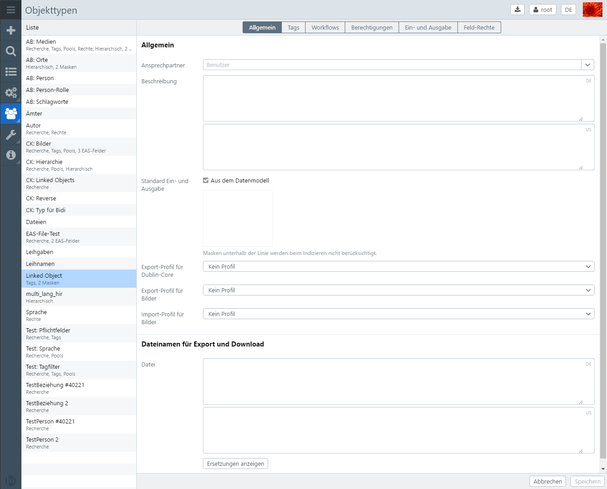
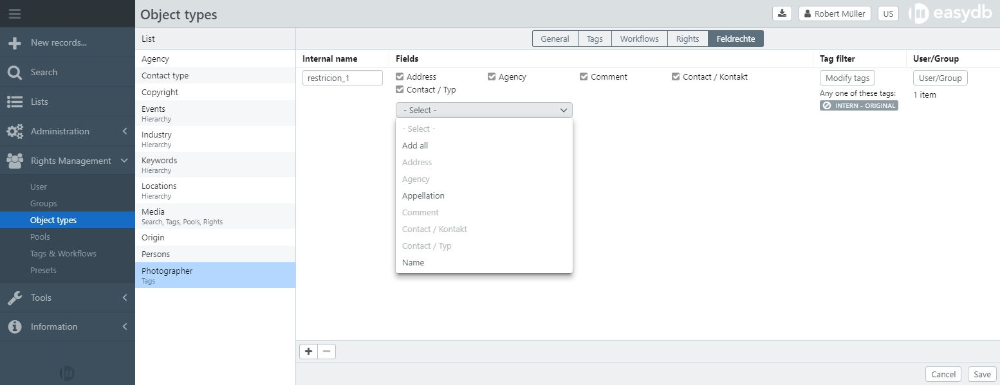

# Object Types

Output settings and access permissions can be controlled with the object type's settings in the rights management section. Depending on the configuration in the data model, different tabs are available in the settings. Please refer to the notes on the respective settings.

Object types are created by administrators in the [data model](../../administration/datamodel/datamodel.html). Changes in the development environment for the data model must be committed so that they may be used. Enabling the changes will set up a complete new build of the easydb data index and may take some time. This process is not necessary for changes in the rights management.

> NOTE: If changes to existing object types occur, it may happen that affected data records can not be displayed to users until the new easydb data index has been completed.




## General

| Setting | Option | Description |
| - | - | - |
| Contact | | The user who appears as a contact for records of this object type in the search view. If a contact is specified, the name appears in the Info dialog next to the object type in the selection next to the search bar
| Description || Here you can define a description for the object type, also multilingual if configured. For users, the description next to the object type is displayed as information in the pool and object types selection menu
| Standard input and output || If set, you can make the order of the masks a priority when selecting the default mask. For users, a list of permitted masks is created by means of the right management. In a second step, this order determines the default mask used to display the search result. If not set, the default mask from the data model is used. Note that this setting can still be changed for object types at the pool if it is a pool management object type
| Export profile for Dublin Core | No profile | No export of metadata is made from this object type
| | &lt;Mapping from the profile management&gt; | The specified mapping is used during export. |
| Export profile for images | No profile | No file metadata (XMP, EXIF, IPTC) is written when exporting images from this object type
| | &lt;Mapping from the profile management&gt; | The specified mapping is used for the export. Existing metadata will be overwritten
| Import profile for images | No profile | When importing images, no file metadata (XMP, EXIF, IPTC) is written to easydb
| | &lt;Mapping from the profile management&gt; | The specified mapping is used for the import. |
| File names for export and download | &lt;Name of the database fields&gt; | When exporting and downloading, files are named in the specified format. Click on <code class="button">Display Replacements</code> to see which translations are available for a filename. For an object type *images*, for example, the file name might be set as follows: For text fields, ```My-Easydb% images.titel%``` and for linkspaces, ```My-Easydb-% bilder.lk_copyright_id._standard. 1.text% ```. |
|| Replacements | see *Enhanced Settings* [File Name Replacements](../../datamanagement/features/export/export.html) |


## <a name="tags"> </a> tags

The availability of tags can always be adapted easydb-wide (see [tags & workflows](../tags/tags.html)). If tags are enabled for an object type without a pool, this is displayed in the list below the object type. In the detail display for the object type, the *Tags* tab is available. This is the easydb-wide defined tags for the object type (see [tags & workflows](../tags/tags.html)). To make individual adjustments, the checkbox "My tags list" must be activated in the lower right corner. Tags that generally have the "persistent" attribute can not be changed here. For all other tags, you can define individually whether the tag should be active and thus be available for the records of this object type, or whether it should always be set automatically when a new data record is created for the object type. To do this, activate the "Pre-setting" checkbox. In this case, the tag can be manually removed from the record.

> NOTE: Tags and workflows are only available for an object type if they do not have activated pool management and tag management is enabled.


| Setting | Description |
| - | - |
|Single Tabs List | In order to overwrite the global tag management, this checkbox must be set. Note that tags marked as *persistent* can not be overridden|
| Active | Must be set so that the tag is active for this object type|
| Default | If set, this tag is active for new records of this object type by default|
| Persistent | If set, the tag in subordinate pools can no longer be overwritten. Only available in [Rights Management&nbsp;&gt;&nbsp;Pools](../pools/pools.html) |

## Workflows

In general, the workflows are described in [Tags & Workflows](../tags/tags.html#workflows).

| Setting | Description |
| - | - |
| Own workflow | If set, all workflows that are not set to *Persistent* are set in [Tags & Workflows](../tags/tags.html#workflows). If not, the workflows defined here supplement the global|


### Action Email

The e-mail action sends an e-mail to users or/and groups that logs the operation to the record. You can enter multiple recipients.

| Setting | Description |
| - | - |
| Recipient | User or group (s). |
| Subject | The subject of the e-mail. |
| Message | The text of the e-mail. |
| Bulk Send |If activated, this e-mail is part of the group of e-mails, sent by a workflow, that a user can receive (see also Schedule in User Management). Otherwise the e-mail will be send immediately after the operation. |

### Action Set/remove tag

You can set or remove any tags as an action. To do this, click on the respective tag. Select multiple will switch the tag between plus, minus (minus tag) and no symbol (nothing to do with the tag). After the tags are set, the workflow is completed, no further workflows are triggered with respect to this tag change.


## Authorizations

Here you define which rights users and groups have in records that are of this object type.

You can find an overview of the rights [here](/#rights).


## <a name="masks"> </a> input and output

Easydb uses an index to search. This index is updated whenever a user saves or deletes a record. In these cases, only the new record in the index is updated. When a database schema is activated, the entire index is recalculated. In the recalculation time, a user may find an old record in his search result. In the editor, however, current records are always displayed.

The Index service creates an index document for each record per record. If an object type has 3 masks, then the index has a separate index document for each mask.

Basically, a record in its most recent version is written to the index. If this is not desired, a different version can be specified in the *Input and Output* tab. The version is determined by a tag filter. The last version of the record to which the tag filter fits is used to store it in the index. If no record fits, the record is skipped and is not written to the index. Users who have access to a restricted mask, for example, can not find the record in this case.

> NOTE: Settings for input and output are only available for object types for which several masks are defined in the data model.

### Example

An example will illustrate this. We created two masks *Standard* and *Internet* and two tags *Internet* and *Locked* in the system.


#### Setting in the Input and Output tab

| Input and output | Day filter |
| --- | --- |
| Standard | *No tag filter possible* |
| Internet | Tagfilter: ALL: *Internet*, NOT: *Locked* |

#### Created tags

| Day | Type | Comments |
| - | - | - |
| Internet | Individual ||
| Locked | All Versions | This is important, *All Versions* will be applied to all versions of the record

#### History of the record entry

In the present example, a data set from version 1 to 6 is provided with different tags. Depending on the date set, it is indexed in the *Internet* form or not.

| Version | Internet<br>*Individual* | Locked <br> *All versions* | Description |
| --- | - | - | - |
| 6 | X | - | The data set has been unlocked, now the **Version&nbsp;5** is indicated for the screen *Internet* because the tag *Locked* applies to all versions|
| 5 | X | X | The record is completely blocked, but now the *Internet* tag is still on|
| 4 | X | - | The record was released again. The **Version&nbsp;2** is now indexed for the screen *Internet*|
| 3 | - | X | The record in the *Internet* form is not indexed because the tag *Locked* is set|
| 2 | X | - | The record has been released. The **Version 1** is indexed for the screen *Internet*|
| 1 | - | - | The record is not shared and is not indexed via the *Internet* screen|

## Field rights {#fieldrights}

You can use the field rights to define rights to individual fields for users or user groups within an object type. At the same time, these fields are hidden for all other users or user groups. The field rights can also be linked to tags if tag management is active for the object type.



|Setting|Description|
|--|--|
|Internal name|Name for this field as appears in the database. This is the technical name of the field, which is required before saving. |
|Fields|Select the fields, which need to be selected within the dropdown menu. The selected fields are displayed with a checkbox at the top and appear inactive in the dropdown. All fields that will be still visible appear active in the dropdown.|
|Tag filter|If tag filters are active for the object type, you can select a condition under which the restriction takes effect.|
|User/Group|Here you can enter one or more users or groups for which the field right applies. Giving field rights to specific users removes the right to these fields from all other users and user groups. Exceptions can be added to individual users and groups by activating "Ignore field rights" via [System rights](../rightsmanagement.html#aclsystem).|

> NOTE: The field permissions can be used to refine the visibility of fields for users or groups. Complex field configurations for object types as well as the input and output options for the fields are set at object type and mask level in the [data model](../../administration/datamodel/datamodel.html).

