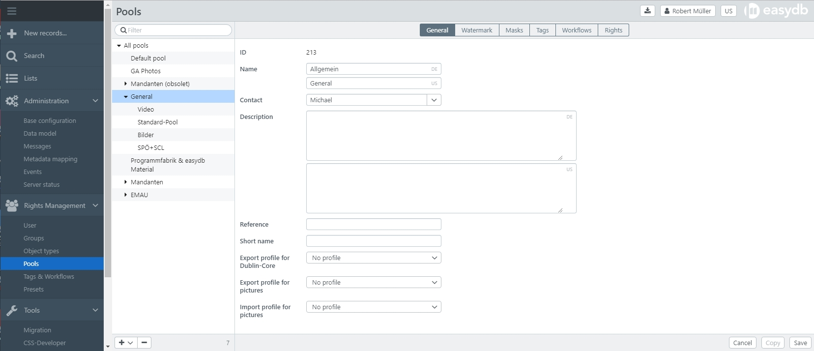

# Pools

Easydb stores records for whose object type *pool management* is enabled in pools. Pools can be used to record:

* To structure the content
* Organizational structure
* For operations

Pools are managed in a hierarchy. The root pool is at the top of the hierarchy. Other pools can be ordered and/or organized hierarchically. All the settings that are made in a parent pool are sent out to all children (including child children, etc.). This setting can be overridden in the child pools (children).

> NOTE: Changing the name of pools and watermarking can cause complex re-calculations on the server side.

## General

| Setting | Note |
| --- | --- |
|ID|Is assigned automatically when the pool is created.|
|Owner|By default, this is the creator of the pool. Other users can be selected as pool administrators. Only users with the system right *root* can change the owner. For information on configurating rights for pool administrators, refer to the chapter [multitenancy](../../../tutorials/mandanten/mandanten.html).   |
| Name | Name of the pool, multilingual. A name change entails a complete re-indexing of all affected records, which may take some time
|Contact| Contact for the pool. Is displayed to the users via <i class="fa fa-info-circle"> </i> in the pool overview.|
|Description  |Multilingual. Is displayed to the users via <i class="fa fa-info-circle"> </i> in the pool overview.|
|Reference|Is used for exports with OAI/PMH and Deeplinks. Must be *unique*.|
|Short name |Is used for exports with OAI/PMH and Deeplinks. Must be *unique*.|
|Export profile for Dublin-Core|Default mapping for Dublin Core exports. The user can also choose a different mapping for the export.|
|Export profile for images |Default mapping for the export of images. The user can choose another mapping for export, but this is not possible with a simple download, where the mapping set here is used.|
|Import profile for images|Default mapping for the import of images. The user can also choose a different mapping for the import.|

## Watermark

For images, easydb can add a watermark to the images depending on the pool. In this tab you define which image is used as a watermark.

| Setting | Note |
| - | - |
|The watermark | For the picture |
|Dissolve | the transparency of the image |
|Position |Position of the watermark as a heavenly direction |
|Size |Size of the watermark |
| Tiles | Watermark is displayed as tile image. |

> NOTE: The watermark defined for a pool is not automatically assigned to subordinate pools. The settings must be made per pool (equivalent) and poole level (subordinate).

## Masks

For each object type that is enabled for pool management, the order of the masks used by the user to display records can be defined here. The first mask is then output as the default mask.

| Setting | Note |
| - | - |
| Object Type | Accepts the object type settings. Available only in the root pool|
| From the parent pool | Removes the settings from the parent pool. Not available in the root pool|
| &lt;Mask&gt; | Use the drag handle to move the masks to the desired order. *Note: If you drag the mask under the double line, it is not indexed. The user can not see records with this form. 

## Tags

See chapter [Object Types](../objecttypes/objecttypes.html#tags).

## Workflows

See chapter [Object Types](../objecttypes/objecttypes.html#workflows).

## Authorizations

Here, you specify which rights users and groups receive for records that are located in this pool or in one of the subordinate pools.

| Setting | Note |
| - | - |
|single Rights List |If this checkbox is set, rights from the parent pools are not accepted, unless they are marked as *Persistent*. This function is not available for the root pool |

All further explanations to the attorneys and an overview of the rights can be found [here](../#rights).