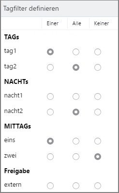
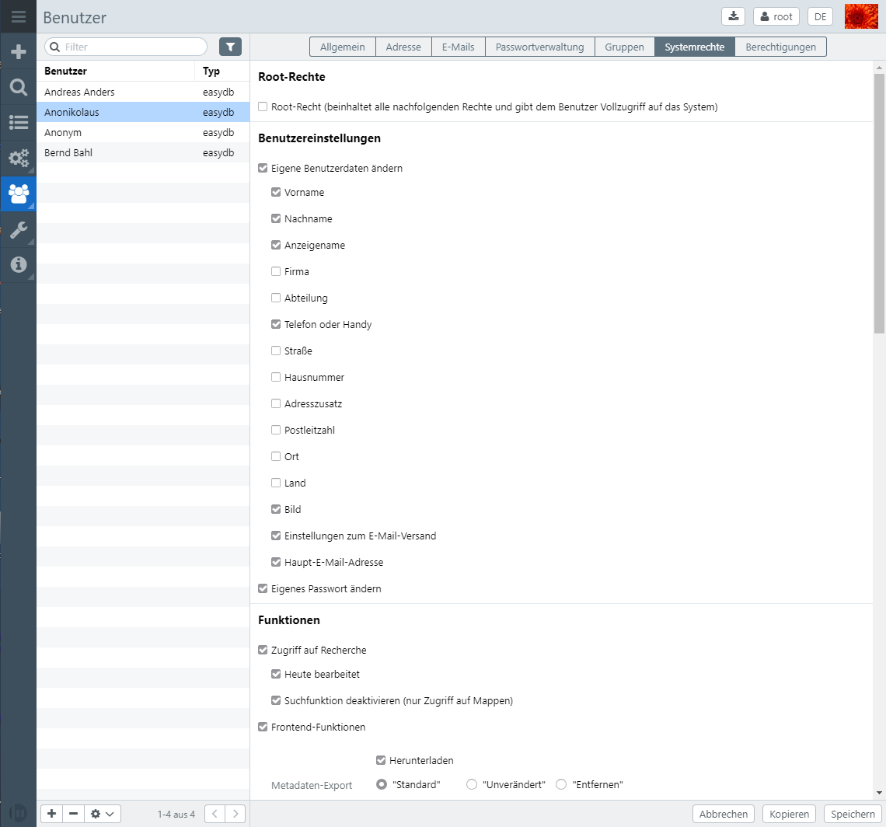

# Rights Management

The rights management in the easydb is in many parts multi-level, additive, and customizable by the administrator in real-time. The rights management changes the searchability and visibility of data and data sets.

> NOTE: In multi-user environments, rights can be added to easydb addditively. This means that rights that are assigned to a user in one place can not be revoked elsewhere.

Essentially there is the possibility to:

1) define the rights and authorizations at the level of the system in order to control access for users and user groups to defined areas;
2) Configure authorizations at the level of the content and thus control the visibility of records

Records management functions in these areas:

* Object type
* Pool
* Tags
* Record

Rights assigned to the first two levels * Object type * and * Pool * refer to groups of records. They affect all records assigned to the range. The use of tags refers to groups of records as well as individual records.

In principle, it is possible to set up rights for individual users and user groups. By combining system, data and user rights, a very differentiated management of the rules is possible, as not only static access rights, but also dynamic rights processes can be represented.

## User

Users are managed in easydb by the administrator. With appropriate permission, other users can also indirectly create new users (for example, e-mail users with restricted rights) and automatically create them (Anonymous users and folder users). [More ...](./users/users.html)

## Groups

Each user can be in one or more groups. Rights can be assigned to groups. If a user is a member of several groups, he gets all the rights assigned to the groups to which he belongs. [More ...](./groups/groups.html)

## Object Types

On this level, rights can be assigned for all data records of an object type. These rights can not be withdrawn via other layers such as pools, tags and individual data sets themselves, that is, Be careful when granting rights to users at this level. [More ...](./objecttypes/objecttypes.html)

## Pools

Records of object types for the pool management is activated, can be equipped with their rights to a pool. Since pools are hierarchical, this can happen at different levels. Basically, the pools inherit configured attitude to their children, including the rights. [More ...](./pools/pools.html)

## Tags & Workflows

Records tag management is enabled, can get any number of tags. Via tags, rights can be assigned and workflows (transcations) managed. [More ...](./tags/tags.html)

> ### Tag Filter
>
> Tag filters are available in several places in easydb and can be used for object types, pools, presets, and all records for which permissions have been activated (see [data model](../administration/datamodel/datamodel.html)). Where tag filters are available, the tags configured in the system are displayed. In our example, we have created several tags as an example.
>
>
>
> In the present configuration, a record matches the tag filter if:
>
> #. *Tag1* or *one* is set (**one**)
> #. *Tag2* and *at night2* are set (**All**)
> #. *Two* is not set (**None**)
>
> Only if all 3 conditions are met, the tag filter will fit.
>
>

## Preferences

If permissions are set in the preferences, users who do not have administrative rights can share records and folders with these predefined permissions. [More ...](./presets/presets.html)

# System Rights {#aclsystem}

The system rights are explained centrally here. They can be configured for users and user groups.

| Internal name | Name | Selection | Explanation|
| - | - | - | - |
| SYSTEM.ROOT | **Root Rights** | Root right (includes all subsequent rights and gives the user full access to the system) | A user to whom this privilege is assigned has access and modification capabilities in all areas of the system and data. The user has all rights listed below. Changes to individual rights are therefore no longer considered. |
|| Edit data model| Level: | |
||| Current | This right allows access to the current data model. |
||| Development | This right allows you to edit the data model. At the development level it can be modified and further developed parallel to the current data model. |
||| Activate changes | The "Enable changes" function transfers the data model from the development level to the current level and is available to users for use. Attention: Deleting existing fields will also result in the deletion of the data contained therein. |
|| Detailed view for your own errors (API only) || The user can view technical details of error messages that he received in the easydb frontend |
|| Detail view for all errors || You can see technical details about all error messages (also those of other users) (currently only via the API). |
|| Basic Configuration | | Access to the Basic Configuration area: Includes system settings, upload processes, logon procedures, CSS settings, export and OAI / PMH settings, access to server config|
|| Show server status || Access to information about server sysat for system, index, EAS, Elasticsearch |
|| Profiles | | Access to export profiles|
|| Messages | | Access system notifications|
|| Search | Options: | |
||| Edited today  | In the [Quick Access](../datamanagement/search/quickaccess/quickaccess.html), the user is given the additional function of having folders with the status *edited today*. |
||| Disable search function (access to folders only) | User has the right to access shared folders and download data. The search function is not available. Other records can not be viewed. |
|| Individual authorizations for sharing | The user has the right to adjust the calculations for transferring individual data records. | |
|| Front-end functions | Options: | Checkbox must be activated to select from the options|
||| View Change History| Allows access to the logs of the change history |
||| Download |Allow downloading assets |
||| Metadata Export: | |
||| "Standard" | When downloaded, the meta-information that is defined by the pool or object type is downloaded. |
||| "Unchanged" | When downloading a file, only the metadata that was already contained in the file was uploaded. |
||| "Remove" | When you download a file, all metadata is removed |
||| Other options: | |
||| Exporting |  Allows the user to export records from easydb. |
||| Use Group Editor ||
||| Detailed view for metadata | The user has access to the assigned functions for sharing data |
||| Folders: | |
||| Share | |
||| Permissions: | |
||| Create Email User | |
||| Create a presentation ||
||| "Saved Searches" ||
||| Share deep links | |
||| Printing | |
|| Manage object types || The user has access to the object types area and can modify and delete them. |
|| Pool management || The user has access to all pools for which he has the right (as root on all pools)|
|| Manage tags and workflows || The user has access to the Tag Management area and can edit and modify tags and workflows. |
|| Manage share settings | |
|| User | | |
||| Create user | The user is allowed to create new users in the easydb. |
||| Create permissions for new users ||
||| Assign system rights to new users ||
||| Do not display in frontend ||
||| View all groups ||
|| Groups | | |
||| Create groups| The user is allowed to create and manage new groups in the easydb. |
||| Create permissions for new group ||
||| System rights assigned to new group ||
||| Do not display in frontend ||
|| Change your own user data || The user is authorized to change his own user data|
|| Change password|| The user is authorized to change his own password|
|| Create User Registration | Fields: | |
||| First name | |
||| Surname ||
||| Type: | |
||| Easydb | |
||| Easydb_self_register | |
||| Custom | |
||| Other options: | |
||| User-defined type | |
||| Group required ||
|| Lists || The user is authorized to create and edit records in lists|
|| CSS Developer | | Ber To make adjustments to the design. |
|| Events | | Display of logged events in easydb |

# Data Rights

## Lists {#acllist}

Data rights are managed in lists. The lists are always based on the same principle, the rights which are configured with them are always context dependent. Within the lists, we are talking about rights. The order of the right-hand lines does not matter, since the rights are managed admirably.

| Setting | Note |
| - | - |
| Users / Group | The selection determines for whom this right-hand line applies, depending on the context, there are different user types, which are allowed here. An already selected selection can be undone with <code class="keyboard-key">Backspace</code> or <code class="keyboard-key">Delete</code>. If you press <code class="keyboard-key">Esc</code>, the search will close first, and the next time the selection will return to its original value|
| Created | Date and time when this right was created|
| Right | The button opens a form with the available rights. Depending on the context, the different rights (see table below)|
|Tag filter| With a tag filter, the right-hand line is only activated if the filter passes the managed records. How to use a tag filter is [here](#TagFilter)|
| Persistent | The right-hand line can no longer be overwritten. This applies to the pool and map context. In either case, rights can be invalidated and overridden within the hierarchy unless *Persistent* is selected|
| Start | Time at which a right-hand line begins to work. This allows temporary release|
|End |date at which a right-hand line ends|
|Copy|Rights can be copied in easydb. Beside <code class="button"> + </code> and <code class="button"> - </code> the button <i class="fa fa-files-o"> </i> is available. When you click on the button, the selected rights line is copied and can be adjusted afterwards.|

In the context *folders* there are other settings: *Active*, *Email*, *Link*. For a more detailed description, see [collections](../datamanagement/search/quickaccess/collection/collection.html).

##  Rights

Rights can have parameters. If rights can be selected alternatively as radio buttons, they appear as checkboxes.

| Internal name | Right | Parameter | Explanation |
|---|---|---|---|
|| View user |||
|| Edit user |||
|| Remove User |||
|| View Group |||
|| Edit Group |||
|| Remove group |||
|| Add a user to the group |||
|| Remove user from group |||
| Read | View objects | grantable ||
| Write | Edit Objects | grantable ||
| Delete | Remove Objects |||
| Acl | Edit Registry Editors |||
| Create | Create objects || Determines whether objects can be recreated. |
| Change_owner | Modify the owner of the object. |||
| Mask | Allowed masks | &lt;Masks&gt; | A list of the masks allowed for the user. Note that the basic prerequisite for working with easydb is! The *standard* mask can be selected |
| asset_preview | Allowed preview versions | Version list | The list of allowed preview versions. Preview versions are defined in [System Configuration](../../sysadmin/konfiguration/konfiguration.html). Note that new preview versions must be explicitly enabled in the right-hand management |
||| File fields | If set, the access for preview versions is limited to specific data fields. |
||| Grantable | Right can be passed on in the *folders* |
| asset_drm_free | DRM-free version || If set, the user can see a DRM-free version as a preview. In [Pool Management](./pools/pools.html),  you can configure images to get watermarks. The watermark is considered as DRM (Digital Rights Management) |
| asset_upload | Asset upload || The upload refers to whether uploaded files can be used for this object type. Easydb can only perform this check after uploading and saving an object type since it is not yet known which type of file is being uploaded |
||| Grantable | ... |
||| Asset fields | Restriction of the fields to which one file can be uploaded. |
||| Maximum file size | Maximum size in bytes, leave the field blank if you do not want any restriction. |
||| Allowed file class | The allowed file class. If set, the file class is allowed completely (all supported formats). If you do not want this, you can perform a single unblocking with *Allowed file names* |
||| Allowed file names | If you have not shared the entire file class, you can make a single unblock here. |
| Link || Link objects | The right to link a record to a group (e.g., pool, folder, user group) |
| Unlink || Remove objects | The right to remove a record from a group (e.g., pool, folder, user group). |
| bag\_read ||| Allows to read a group (e.g., pool, folder, user group). This is about the group itself, not the records that are linked to the group |
| bag\_write ||| Allows you to write a group (e.g., pool, folder, user group). This is about the group itself, not the records that are linked to the group |
| bag\_delete ||| Allows removal of a group (e.g., pool, folder, user group). This is about the group itself, not the records that are linked to the group |
| bag\_acl ||| Edit a group's |
| bag\_create ||| Create a subgroup (pools, folders). |