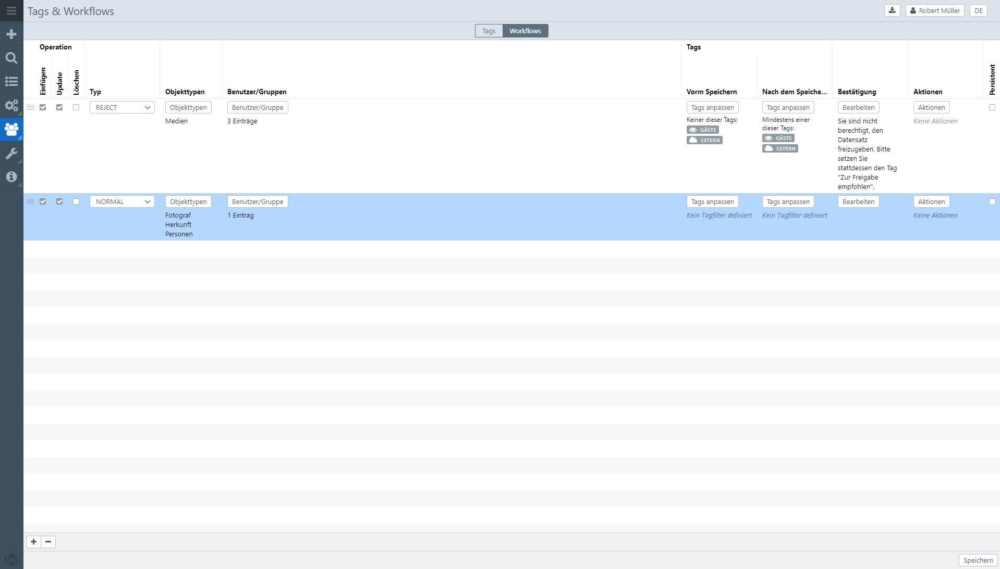

# Tags & Workflows

Tags are switches that can be managed on records that belong to object types that have *tag management* enabled. You can turn these tags on or off when you edit them.

Not all tags are always visible and changeable. This is controlled by workflows that monitor tag changes, forbid, allow, and execute actions when a tag change has been made.

Tags can also be used to highlight records for the user with small icons.

Tags are also used to perform computer management. This is, however, a very powerful tool. Since the easydb rights management system works additively, a one-time (by one day) right can not be withdrawn.

> Tags are defined globally. This is useful for keeping an overview and not creating a day chaos within individual pools. However, tags can be switched on and off per pool or object type. Pools and object types can define their own workflows using system-wide tags.

Tags can be structured into groups for a better overview. A tag group can also be defined as *Selection* if, then only one day can be active from this group at the time.

## Tags

| Setting | | Description |
| - | - | - |
| Name | | Ad name of the tag or tag group. Multilingual. Look for brief explanatory terms, e.g. *Status*, *Locked*, *Internet enabled*, *Check*, *Frequently*, *Ok*
| Type | Checkbox | Tag group consisting of individual tags that can be switched on and off individually. Only for day groups
| | Select | Tag group consisting of a tag selection. Here, only one or none tags can be selected, but not several
| | Individual | Normal day for switching on and off. Only for tags
| | All versions | A tag that applies to all versions of a record. This tag is ignored in old versions of a record. This is used to index records in editorally released versions. The setting is made for each [object type](../objecttypes/objecttypes.html# masks) |
| Display | Editor | Tag is only displayed in the editor. |
| | Detail + Editor | Tag is also displayed in detail (if set). |
| | Search + Detail + Editor | Tag is also searchable
| | Do not display | Tag is not displayed. This can be useful if you want to define workflows that work with hidden tags
| Description || Optional text displayed to the user in a tooltip. Multilingual. |
| Default || If set, the tag for new records is switched on by default. |
| Persitent || If set, the tag can not be de-activated for [object types](../objecttypes/objecttypes.html) and [pools](../pools/pools.html)
| Icon | | An optional icon. In connection with the display in the search result and detail this icon is used to mark the record
| Rights || Here you define which rights users and groups have to records with which this tag is connected. You can find an overview of the rights [here](../rightsmanagement.html#rights)

##  Workflows

The workflows are executed when records are created, saved, or deleted. Easydb collects appropriate workflows before saving, creating or deleting them, and executes them one at a time.

> If workflows are created, at least one worflow must match the action, otherwise the action will not be executed. If no workflows are created, each action is allowed (in the context of the management of the right).

An operation then fits into a workflow if the following checks have been passed:

* The *operation* must match (Insert, Update, Delete).
* The *user* or the *group* must match the executing user.
* The *Tagfilter* *Before saving* and *After saving* must fit
* The user must have confirmed the operation (if confirmation is required)

When all workflows have been confirmed, the operation is performed, and then actions that are connected to the workflows are performed. Currently, easydb supports the following actions:

* Send email
* Set or remove tags

| Setting | | Description |
| - | - | - |
| Operation | Insert | The operation is a new creation of a data record. |
| |Update |The operation is an update of a record|
| | Delete | The operation is to delete a record. |
| Users/Groups || Define for which users and/or groups the workflow applies. |
| Tag filter | Before saving | Sets a tag filter before saving. Records must match the tag filter before the action so that the workflow finds application. This tag filter is ignored for new records
| | After saving | Sets a tag filter after saving. Records must fit in the version to be saved to the tag filter so that the workflow finds application. This tag filter is ignored during deletion
| Confirmation || Enter a text that the user must see and confirm when the workflow is executed. For example, a text may be available before an Internet publication. This text is multilingual
| Actions || Actions are executed in the specified order after all workflows have been confirmed and the actual operation has been performed
| Persistent || If set, the tag in subordinate levels (object types, pools) can no longer be overwritten. |

> For an explanation of how tag filters work, see [here](../rightsmanagement.html#tagfilter).